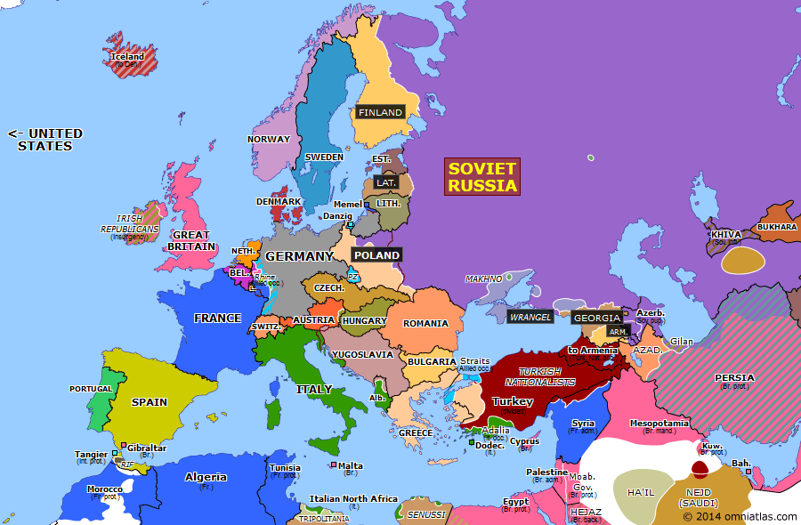
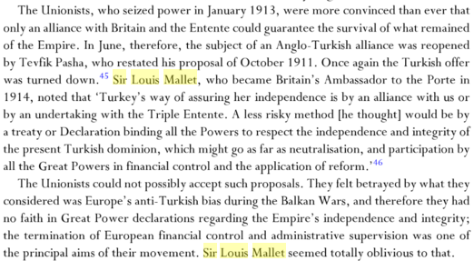

# Ağır Kitap

*Sevan Nişanyan*

### Kitaplar

* ...

### Notlar

* Türkiye’deki bu baskıcı, fanatik milliyetçi anlayış esasen 1923’ün
  eseri değildir. 1913’e hatta 1908’e gider bunun kökleri. Dolayısıyla
  Cumhuriyet ideolojisinin arkasında yatan asıl ideolojik formasyonun,
  İttihat ve Terakki olduğu muhakkaktır. Bugüne kadar da ülkenin
  düşünsel yapısına egemen olan sistem budur, İttihatçılıktır.
* Dünyanın Müslüman yoğunluğu en yüksek olan ülkesidir Türkiye, Suudi
  Arabistan ve Libya ile birlikte.
* Cumhuriyet büyük bir başarıyla eskiden üçte ikisi müslim üçte biri
  gayrimüslim olan bir toplumu yüzde 99.8’e arındırmayı başarmıştır.
  Böyle bir rejimin laikliğinden söz etmek mümkün değildir.
* Türk demokrasisi 1950’de bir mutabakat üzerine kuruldu. CHP liderliği ile
  DP kurucuları (ve tabii terazinin o devirde sadece bir ucunu tutan askeriye),
  açık veya kapalı, şöyle bir uzlaşmaya vardılar: Tek Parti döneminin
  temel tasarrufları sorgulanmayacak. Devr-i sabık yaratılmayacak.
  Cumhuriyetin kurucusu her türlü tartışmanın üzerinde tutulacak.
  Birtakım şeyler kutsal bir haleye büründürülüp, adeta mumyalanıp,
  ülkenin mukaddesat galerisine kaldırılacak.
* DP iktidara geldikten hemen sonra, Atatürk’ün 13 yıldan beri bir çeşit
  Araf’ta bekletilen cenazesi, Cumhuriyet’in mabedi olarak tasarlanan bir
  anıt mezara nakledildi. Paralardan kaldırılmış olan resmi yeniden
  tedavüle sokuldu. 1920 ve 30’lara ait bir dizi yasa “Devrim Kanunları”
  olarak kutsandı.
* 1951’de çıkarılan [5816 sayılı
  yasayla](https://tr.wikisource.org/wiki/5816_say%C4%B1l%C4%B1_kanun)
  Atatürk’ün anısı, dinlere ve peygamberlere özgü koruma şemsiyesi altına
  alındı.
* Totaliter düşünce ise der ki, vatanın, milletin bir yüce Öz’ü
  vardır. Bu Öz dindir, Kitaptır, Nutuk’tur, Devrim’dir, şanlı
  atalarımızdır, şanlı proletaryadır, fark etmez. Önemli olan o tekil ve
  yüksek irade kavramıdır. Bu iradeye boyun eğen her şey meşrudur. Akla ve
  vicdana uymasa da, yalan ve yanlış olsa da meşrudur. Çünkü en yüce
  değere hizmet eder. Bu iradeye boyun eğmeyen her şey gayrimeşrudur. Gaflet
  ve dalalet içindedir. İnat ederse vatan hainidir. Her görüldüğü yerde
  ezilmesi yalnız hak değildir, görevdir.
* Son beş yüz yılda icat edilip insanlığın genel kullanımına sunulan
  uygarlık ürünlerinin hepsi, ama HEPSİ, Batı’nın on-on iki tane
  ülkesinden çıkmış. 1500 gibi bir tarihten bu yana Doğu’nun –
  Hind’in, Çin’in, İslam ülkelerinin, hadi Afrika’yı da sayalım –
  insan medeniyetinin evrimine dişe gelir BİR TANE BİLE katkısı olmamış.
* Devletin her boka maydanoz olamayacağı, kamu otoritesinin dokunulmaz
  sınırları olduğu, kamu yararının tek elden belirlenemeyeceği, birtakım
  hak ve özgürlüklere tecavüze kimsenin gücü yetmeyeceği gerçeği,
  Avrupa’nın başına ta 1200’lerde, yani bizdekilerin “Ortaçağ
  karanlığı” diye dalga geçtiği bir devirde dank etmiş.
* Batı zalimmiş, Batı adaletsizmiş, Batı bencilmiş, şöyleymiş
  böyleymiş, bunlar züğürt tesellisi. İnsanoğlu zalimdir. Gücü yeterse
  daha zalimdir.
* Batı zalim olduğu için güçlü değil, güçlü olduğu için daha rahat
  zulmetme lüksüne sahip. Doğunun farkı daha az zalim olması değil,
  marjinal bazı alanlar dışında son 300-500 senedir Batıdan daha güçsüz
  olması. Gücün kadar zulmedersin.
* Amerikalılar Irak’ı yakmış: Sanki Türkler yirmi beş senedir
  Güneydoğu’yu yakmıyorlar. Ya da 1870’lerde Bulgaristan’da,
  1840’larda Lazistan’da, 1820’lerde Yunanistan’da, 1770’lerde Podolya
  ile Ukrayna’da başka şey yaptılar. Kuzey Kıbrıs’ın Rumları da
  1974’te Türklerin imajı bozulsun diye evlerini barklarını bırakıp
  kaçtılar. (1915’i hiç saymıyorum, malum onu Türkler yapmadı,
  Dürkheim’le August Comte yaptı.)
* Ya zavallı Kızılderililer? İslam egemenliği altında adalet ve huzur
  içinde yaşayan Süryaniler, yahut Mısır Hıristiyanları, yahut Anadolu
  Rumları veya Fas Yahudileri ya da Darfur yerlileri kadar şanslı değillerdi
  herhalde! Kara Afrika’da da Avrupalılar gelmeden önce Araplar zaten bin
  sene boyunca köle ticareti yapmıyordu da, mesleğin püf noktalarını beyaz
  adama onlar öğretmediler.
* Yüz yıldan beri aklın ve vicdanın sürekli olarak tekmelendiği bir
  memlekette, aklına ve vicdanına bir dayanak arayan insanlar – başka
  seçenek olmadığı veya bilmedikleri için – çareyi İslam dininde
  arıyorlar.
* Birinci Dünya Savaşında Türkiye, İngiltere karşısında feci bir
  hezimete uğradı. Her kilometresi için çatır çatır savaşarak, bugünkü
  Türkiye’nin aşağı yukarı dört katı toprak kaybetti. Bu topraklar
  üzerinde daha sonra Hicaz, Suriye, Lübnan, Irak, Ürdün, İsrail diye altı
  tane devlet kurdular.
* 1918 Eylülünde Allenby’nin ordusu bugünkü İsrail’in ortalarında bir
  yerde hücuma geçti. Alman başkomutanın yanında Mustafa Kemal Paşanın
  kumanda ettiği 7. ve 8. Osmanlı ordularını neredeyse tüm mevcuduyla esir
  aldı. Bunu haber alan Ürdün’deki 4cü ordu da çil yavrusu gibi
  dağıldı. Bir buçuk ayda İngilizler Suriye’yi aşıp Kilis-İskenderun
  hattına dayandılar. Karşılarında organize birlik namına bir şey
  kalmamıştı. Fransızlara verilmiş sözleri vardı, Adana ile Maraş’ı
  alıp size vereceğiz diye. Buna rağmen, bugüne dek açıklanmamış bir
  nedenle, İngilizler bu hatta durup ateşkesi kabul ettiler.
* 1918’de Britanya İmparatorluğunun silah altında yaklaşık beş milyon
  askeri bulunuyordu. Bunların yüz bin kadarı – kimi kaynaklara göre 150
  bini – Filistin ve Irak cephelerinde Osmanlı ile savaştı. Demek ki
  İngiltere, toplam askeri gücünün otuz üçte birini ya da ellide birini
  Türk cephesine ayırmıştı. Buna karşılık, Kafkasya fethine çıkan
  derme çatma seferi gücü saymazsak, Türk ordusunun aktif mevcudunun
  tamamına yakını bu tarihte İngilizlere karşı harpteydi.
* 30 Ekim 1918’de Mondros’ta ateşkes imzalandı. Ateşkes hükümleri
  ağırdı: Türk ordusunun artanı derhal terhis edilecek; müttefik esirleri
  bırakılacak; ateşkes sınırının dışında kalan birlikler teslim
  olacak; galip devletler gerekli gördükleri limanları, demiryolu
  istasyonlarını, stratejik noktaları işgal edecekler; askeri teçhizat
  teslim edilecek. Bunlar ağır hükümlerdir, ama aynı günlerde
  Bulgaristan’a, Avusturya-Macaristan’a, Almanya’ya dayatılan ateşkes
  koşullarından pek farklı değildir.
* Bir buçuk sene sonra ilan edilecek olan Misak-ı Milli’nin her ne pahasına
  olursa olsun savunmaya ant içtiği “gayrı kabili tecezzi” vatan
  toprakları, Mondros ateşkesi ile belirlenen sınırlardı.
* Maksatları sırf Türkiye’yi güzelleştirmek de değildi, kuşkusuz.
  Kasım 1917 itibariyle Kuzeyde beliren büyük tehlikeye karşı sağlam
  duracak, ekonomisi düzgün, her an dağılıp bölünme kaygısı olmayan,
  Batı’yla iyi geçinen bir ülke lazımdı. Bunun için önce memlekette
  rejimin ve zihniyetin değişmesi gerekiyordu. Bir Adenauer yahut Brandt
  aradılar. Altı ayda gördüler ki İttihatçı yapı sapasağlam ayaktadır,
  memleketin her hücresine sinmiş, her tersanesinde örgütlenmiştir, ve
  Türklere rejim değiştirtmek deveye hendek atlatmaktan daha zordur.
* Sevr’de, daha önce dünyada tek bir tane örneği olmayan yeni bir model
  önerilmiştir. Türkiye’nin bağımsızlığı fiilen lağvedilir. Ama o
  zamana kadar dünyada usul olanın aksine Türkiye bir ülkenin kontrolü,
  vesayeti, mandası vs. altına sokulmaz. Müttefik devletlerden (ama
  ağırlıkla Britanya, Fransa ve İtalya’dan) oluşan çok-uluslu bir
  idarenin gözetimine teslim edilir.
* Öte yandan Sevr, Türkiye’nin toprak bütünlüğünü pek o kadar
  zedelemez. Bizim ders kitaplarında gösterilen “Sevr haritası” düpedüz
  yalandır. Antlaşmaya ekli olan resmi harita öyle değildir. Genel ilke
  olarak, nüfus çoğunluğu Türk (ve Kürt) olan her yer Türkiye’ye
  bırakılır.

  

  
* Antlaşma metni 18-24 Nisan 1920’de üç büyüklerin San Remo
  konferansında şekillendi, 11 Mayısta Türk tarafına sunuldu, 10 Ağustos
  1920’de Sèvres’de imzalandı. Hatırlayın: Milli Mücadele bunlardan bir
  sene önce başlamıştı. Kemal Paşa rejimi Ekim 1919 ile en geç Aralık
  1919 arasında Anadolu’nun tümüne hakim oldu. Büyük Millet Meclisi 23
  Nisan 1920’de toplandı. Demek ki Milli Mücadele Sevr Antlaşmasına tepki
  değildir. Belki Sevr Milli Mücadeleye bir tepki olabilir.

  [Sevr Anlaşması'nın orijinal metni](https://wwi.lib.byu.edu/index.php/Peace_Treaty_of_S%C3%A8vres)
* İngilizler Yunan ordusunu İzmir’e, sonra Bursa-Eskişehir hattına, sonra
  da Ankara üzerine sürdüler, evet. Ama kendileri savaşa girmediler.
* İngiltere’nin hiçbir tarihte Türkiye’den açık ya da kapalı toprak
  talebi olmadı. Fransa’nın Adana-Maraş’ta gözü vardı; İtalya yarım
  ağızla Antalya’yı, Fethiye’yi, Marmaris’i istedi, vermediler.
* Lozan’da İngiliz çıkarlarına aykırı bir şey var mıdır? Hiç
  zannetmiyorum. İsmet Paşa istediği kadar debelensin, sonuçta imzalanan
  metin, baştan yüksek tutulmuş birkaç pazarlık hamlesi hariç,
  İngilizlerin dayattığı metindir.
* Esas konu Sovyet yayılmacılığına karşı sağlam durabilecek dayanıklı
  bir Türkiye kurmaktı, o kuruldu.
* Türk maliyesinin acıklı durumundan dolayı savaş tazminatı söz konusu
  değildi; ama özel hukuk altındaki eski Osmanlı borçları, biraz tenzilat,
  biraz taksit, güvenceye alındı. Boğazlarda uluslararası kontrol kuruldu.
  Birkaç sene sonra Türkiye’nin Sovyetlere karşı pozisyonu iyice
  netleşince o da kaldırıldı.
* Lozan’da kim kaybetti? Yunanistan kaybetti, bu belli. İzmir ve Doğu Trakya
  hayali ellerinden gitti, dayak yedikleriyle kaldılar. Bir de Fransa kaybetti.
  Sevr Antlaşması, Türkiye’ye yakın güç ve büyüklükte, Fransız
  denetiminde bir Suriye öngörmüştü. O iş olmadı. Yirmi sene içinde
  Fransa Ortadoğu’dan silinip gitti.
* Tarihin her döneminde yaşam ve ölümleriyle toplumun ortak özlemlerini
  harekete geçiren kişiler “kahraman” ve “aziz” sayılırlar, bu
  mertebeye yükseltilirler. Türkiye’de olan da budur. Hrant Dink kelimenin
  bu klasik anlamıyla Türkiye’nin son yıllarda çıkardığı tek
  “kahraman”dır.
* Yabancı devletler Kürt mücadelesinin oluşumuna katkıda bulundular mı?
  Bunu bilemem. Ancak 29 yıldır süregelen propaganda çabasına rağmen Türk
  devletinin bu yönde inandırıcı bir delil ortaya koymamış olması,
  sanırım yeterince anlamlı bir olgudur. Her halükârda Batılı
  devletlerin, önemli bir NATO müttefiki olan Türkiye’yi bölmek ya da
  zayıflatmak veya istikrarsızlığa düşürmekte ne gibi bir çıkarı
  olabileceğini anlamaktan acizim.
* Türk siyasi hayatındaki esas çıkmazın Kürt Sorunu değil “Türk
  Sorunu” olduğunu anlamak gerekiyor. Çözüme yönelik düşünmek için
  bence ilk ve en önemli adım budur. Türkiye Cumhuriyetine kuruluşundan beri
  egemen olan ırkçı, hakaretamiz ve hayalperest bakış açısı, salim
  akılla kolayca çözülebilecek en basit sorunları bile çıkmaza sokmakta
  eşsiz bir rol oynamıştır. “Atalarımız” eğer Ortaasya’dan
  geldiyse, Türkiye’de yaşayan herkes eğer “Türk” olmak zorundaysa,
  “Türk” olmayan hiç kimsenin ve hiçbir şeyin (binlerce yıllık köy
  adları dahil) bu vatanda hakkı yoksa, en temel vatandaşlık hakları ulusal
  ideolojiye biat koşuluna bağlanmışsa, rasyonel bir çözüm doğal olarak
  yoktur, olamaz, ve olmayacaktır. “Türk Sorunu” çözülmediği
  müddetçe, Kürt Sorununun kanlı ve korkunç bir sona doğru ilerlemesi bana
  kaçınılmaz görünüyor.
* Türk yönetici sınıfı ve Türk kamuoyu, bu devletin “Türklere” veya
  onlar adına ahkâm kesenlere değil bu ülkede yaşayan herkese ait
  olduğunu, herkesin insan ve vatandaş olmaktan ileri gelen doğal haklara
  sahip olduğunu, her vatandaşın etnik kökeninden, tercih ettiği yahut
  etmediği dinden ve savunduğu siyasi görüşten bağımsız olarak saygıya
  mazhar olduğunu kavradığı gün, Kürt sorunu dahil bu ülkeyi 80 küsur
  yıldan beri hasta eden pek çok sorun kendiliğinden çözülmüş
  olacaktır.
* 2. Yunanistan istila eder. Etmez. Salt İstanbul’un nüfusu Yunanistan’ın
  toplamı kadar. Alsalar başlarına bela olur. Atina bile on yıla kalmaz
  Türk belediye başkanı seçer; Akropol semalarında ezan okuturlar.
* 3. Suriye istila eder. Etmez. Suriye devletinin toplam bütçesi 7 milyar
  dolarmış. Türkiye’ninki şimdilik 170 milyar dolar, ordu yükü
  memleketin sırtından kalksa herhalde iki misli olur. Parasını verip
  Suriye’yi satın alırlar, olur biter. Suriyeliler de memnun olur
  tahminimce.
* Burada bahis konusu olan, son 250 yıldır girdiği her savaşı kaybetmiş
  bir ordu, Yunanistan ve Kıbrıs Rumlarıyla yaptığı üç savaş (1897,
  1919-1922, 1974) hariç. Rusya’yla yedi kere savaşıp yedi kere yenilmek
  gibi dünya tarihinde eşi olmayan bir rekora imza atmış. Daha dün
  kurulmuş Bulgaristan’la Yunanistan ve Sırbistan karşısında iki ayda
  darmadağın olmuş. Güneydoğu’da üç-beş bin isyancıyla bunca senede
  başa çıkamamış, onları yeneceğim diye sivil halkı kırmış, işi
  büsbütün çıkmaza sokmaktan başka sonuç alamamış.
* Modernmiş şuymuş buymuş. Türkiye’de üç gün askerlik yapmış biri bu
  iddiayı ciddiye alamaz. Mıntıka temizliği yaptırmayı Aziz Nesin
  komedisine dönüştürmeyi başaran, bir cemseyi tamir etmek için yüzlerce
  tutanak, emir, fırça, izin, ceza, dayak ve yalan üreten bir mekanizma mı
  modern?
* Türkiye Birinci Dünya Savaşında saldırgan tarafta yer aldı. Tarihin en
  büyük askeri hezimetlerinden birine uğrayıp dağıldı. Savaştan sonra
  burada galiplerin işine gelen bir rejim kurulması gerekiyordu. O rejim
  1923’te aynen istedikleri gibi kuruldu.
* Daha erken kurulabilirdi. Daha kolay ve daha kansız olurdu, memleket o kadar
  harap olmazdı. Belki Tek Adam diktatörlüğüne de o kadar kolay teslim
  olmazdı. Ama 1918’de İngilizler bir hata yaptılar, barış şartı olarak
  İttihat ve Terakki kadrolarının tasfiyesini talep ettiler. Bunun üzerine
  birileri vatanmillet diye haykırarak ayağa kalktı. Altı sene savaştan
  bitmiş bir ülkeyi gözünü kırpmadan tekrar kana ve ateşe sürdü.
* İngilizler kızıp tehditler savurdular, asarız keseriz böleriz Sevr
  yaparız diye gözdağı verdiler, etkili olsun diye Yunanlıları sahaya
  saldılar. Üç sene daha manasız bir katliam oldu. Sonra gene İngilizlerin
  dediği oldu. Tek farkla: İttihatçı kadrodan ayıkladıkları yirmi otuz
  kişi hariç, gerisi vatan kurtaran kahraman kontenjanından memleketin
  tepesinde oturmaya devam etti.
* 1839’dan 1913’e dek Osmanlı devletinde siyasi nedenlerle tek kişi idam
  edilmedi. 1923’ten sonra yüzlercesi pazar meydanlarına kurulan
  darağaçlarında asıldı.
* Medeni Kanun’u adamlar Lozan’da dayattılar, çatır çatır kabul
  ettirdiler. Atatürk değil Hacı Abdülgaffar olsa yapacağı bir şey yoktu,
  kabul etmeye mecburdu.
* Lozan’dan daha yüz sene önce dayattıkları, berikilerin de pek itiraz
  etmeden kabul ettiği şuydu: Gayrimüslim tebaaya İslam hukukunu
  uygulayamazsın. Eğer İslam hukukunu sürdüreceksen gayrimüslimler için
  ayrı mahkemeler kurmak zorundasın. Bunların adil olacağına
  güvenmediğimiz için de gayrimüslim tebaan için kapitülasyon adı verilen
  ek güvenceleri kabul edeceksin.
* Kaldı ki İstanbul Darülfünunu’nun Hukuk Fakültesinde 1880’lerden beri
  Batı usulü medeni hukuk mecburi dersti. 1910’larda da memleketin en
  kalburüstü hukuk talebesinden 10-15 kadarı devlet bursuyla Lozan
  Üniversitesine gidip medeni hukuk tahsil etmişti. Yani memleket ortaçağ
  karanlığında kıvranıyordu da Atam geldi Medeni Kanun getirdi, yok öyle
  şey.
* Türkiye’de “çağdaş” dedikleri bugünkü sistemin temelleri
  1830’larda atıldı, Safvet Paşa’nın 1869 tarihli Maarif-i Umumiye
  Nizamnamesiyle pekişti, Abdülhamit devrinde imparatorluğun taşrasına
  yayıldı.
* İlkokul-ortaokul-lise sistemi bu dönemin ürünüdür. Galatasaray gibi
  dünya çapında bir çağdaş lise 1868’de kuruldu. Maarif Vekâletine
  bağlı ilk kız liseleri 1882’de – yani Fransa ile aynı yıl –
  kuruldu. İstanbul Üniversitesi Abdülhamit’in fermanıyla 1900’de
  kuruldu.
* Manastır’ın kör taşrasındaki askeri lise öğrencilerine 1890’larda
  Fransa’nın siyasi akımları ile çağdaş edebiyatı okutuluyordu,
  Fransızca olarak. Cumhuriyet’in “çağdaş” liselerinde sıkıysa dene,
  Şırnak’a sürerlerse gene şanslısın.
* 1921’de Ankara Meclisi’nin topladığı Maarif Kongresi’nin önde gelen
  kaygısı “şarktan ve garptan gelebilen bilcümle tesirlerden tamamen uzak,
  seciye-i milliye ve tarihiyemizle mütenasip bir kültür” oluşturmaktı. O
  günden beri de değişen bir şey yoktur.
* Devlet reisinin görüş ve emirlerini reddeden herkesi alçak, soysuz,
  vatansız ve gizli emel sahibi hain ilan eden zorbalık diline itiraz
  ediyoruz.
* Bu dil, bir toplumu kuşaklar boyu düzelmemecesine hasta eden ve çürüten
  bir dildir. Düşüncenin ve yaratıcılığın kaynaklarını kurutur.
  Korkuyu ve iki yüzlülüğü bir hayat tarzı haline getirir. En cahil ve
  zorba olanın her zaman zeytinyağı gibi üste çıkmasını
  meşrulaştırır.
* Doksan yıldan beri kafası çalışan ve kahvehane muhabbeti dışında
  söyleyecek bir sözü olan herkese bu ülkeyi zindan eden bu dildir. Muasır
  medeniyetin tiksinerek söz ettiği bir gariban gettoya mahkûm eden de bu
  dildir.
* Cumhuriyet bu dili kurucusundan öğrendi. Ulu Önder’in 1920-21’den
  sonraki her demecine, her söylevine, her cümlesine bakın: baştan aşağı
  tehditnamedir. Büyük Nutuk’un her sayfasını, Önder’le öyle ya da
  böyle görüş ayrılığına düşen kişilere yönelik kan dondurucu
  küfürler süsler. Herhangi bir konuda Reisicumhur’dan farklı düşünen
  HERKES satılmıştır, HEPSİ düşman ajanıdır, imha edilmesi gereken
  zararlı unsurdur; hiç değilse aptal ve zevzektir.
* “Vatan mevzubahis ise gerisi teferruattır” diyen ahlaksızlık
  ideolojisine itiraz ediyoruz.
* Nutuk’ta ilk dikkati çeken nokta, Milli Mücadele sırasında ve
  sonrasında herhangi bir nedenle ve herhangi bir ölçüde Gazi’nin emir ve
  iradesine karşı çıkmış olan istisnasız herkesin,vatan haini,
  satılmış, özel çıkarlar peşinde koşan, ya da en hafifinden gayriciddi
  veya aptal kimseler olarak sunulmalarıdır.
* Dürüst, vatansever, ve az çok zekâ sahibi oldukları halde kendisine
  kayıtsız şartsız itaat etmeyebilecek kişilerin varlığı, reisicumhurun
  kabul ettiği ihtimaller arasında bulunmaz.
* Burada sözü edilenlerin ezici çoğunluğu, ilginçtir ki, Milli Mücadeleye
  Mustafa Kemal ile birlikte atılmış ve o mücadelenin en ön saflarında yer
  almış, ancak bazı konularda farklı görüşlere sahip oldukları için
  Gazi’yle yolları ayrılmış olan insanlardır.
* Nutuk’un en sert polemikleri, bir yanda başta Rauf olmak üzere, Karabekir,
  Refet, Mersinli Cemal, Cafer Tayyar ve Nureddin Paşalar ve Celaleddin Arif
  Bey gibi Milli Mücadele önderlerine, diğer yanda Ahmet İzzet, Ali Rıza
  Paşalar gibi İstanbul hükümetlerinde Milli Mücadele yandaşları olarak
  tanınmış olan kişilere yöneltilir.
* İkinci planda ise, ülkenin çıkarına en uygun hareket tarzının ne
  olduğu konusunda, şu ya da bu gerekçeyle Milli Mücadelecilerden farklı
  düşünen kişiler vardır. Üstelik nutkun söylendiği tarihte bu
  insanların tümü iktidardan uzaklaştırılmış, birçoğu yurt dışına
  sürülmüş ve bazıları idam edilmiş bulunmaktadır. Yani, sıcak bir
  mücadelenin belki bir ölçüde haklı göstereceği bir şiddet veya infial
  burada söz konusu değildir.
* Türk siyasi hayatına İttihat ve Terakki ile giren ve cumhuriyet döneminde
  süren bu üslup günümüzde de etkisini kaybetmiş değildir.
* Birinci Dünya Savaşı'nın son döneminde düşman savaştan sonra kurmak
  istediği düzeni herkesin anlayacağı şekilde açık seçik ilan etti. 5
  Ocak 1918’de İngiltere Başbakanı Savaş Hedefleri deklarasyonunu
  yayınladı. Ondan üç gün sonra ABD Başkanı meşhur On Dört İlkesini
  açıkladı.
* Türkiye’ye dair ikisinin söylediği neredeyse kelimesi kelimesine
  aynıdır.

  - Türkiye’nin nüfus çoğunluğu Türk olan kısmında sağlam, güçlü, güvenli
    (secure) bir devlet kurulmalıdır.
  - Nüfusu Arap olan yerler Türkiye’den ayrılmalıdır; bu yerlerin “serbestçe”
    gelişmesi için galip devletler gerekli idareyi kurmalıdır.
  - Türkiye’nin kalkınması için gerekirse bir veya birkaç devlet yardımcı
    olmalıdır.
  - Savaş esnasında Almanya’nın Türkiye’ye verdiği devasa krediler
    silinmelidir.
  - İstanbul Türkiye’ye bırakılmalıdır.
  - Boğazlar galip devletlerin kontrolünde uluslararası trafiğe açılmalıdır.

  Hepsi bu. Arzu eden bakıp okuyabilir, Wilson’s Fourteen Points veya Lloyd-
  George’s War Aims Declaration diye ararsanız her yerden bulunur. Sonra da
  bir zahmet Lozan Antlaşmasını okuyun, aradaki yedi farkı bulun. Ben
  şahsen bulamıyorum.

  **Okumalar:**

  - [Wilson's Fourteen Points](https://en.wikipedia.org/wiki/Fourteen_Points#Territorial_issues)
  - [Lloyd George's War Aims Declaration](https://wwi.lib.byu.edu/index.php/Prime_Minister_Lloyd_George_on_the_British_War_Aims)
  - [Treaty of Lausanne](https://wwi.lib.byu.edu/index.php/Treaty_of_Lausanne)
* Şimdi ta 1911 yılında İstanbul’daki İngiliz büyükelçisinin
  yazdığı analizleri okuyorum, hayrettir ki orada da hemen hemen aynı
  şeyleri demişler. Aman Türkiye’nin Anadolu’daki toprakları
  bölünmesin, yahut farklı devletlerin etki alanları kurulmasın, yoksa
  dünya savaşı çıkar... İngiltere’nin tek başına Türkiye üzerinde
  garantörlüğe soyunması da olmaz, tehlikelidir... En iyisi Batılı
  devletler ortaklaşa Türkiye’nin bağımsızlığını ve toprak
  bütünlüğünü garantilesinler, reformlara yardımcı olsunlar. Ya da illa
  müdahale gerekiyorsa hep birlikte konsorsiyum halinde müdahale edilsin...
  Merak ederseniz Sir Louis Mallet’in raporu, Feroz Ahmad’in kitabında tam
  metni var.

  **Not:** Kitabın adını ve metnini tam olarak kestiremedim ama
  [The Great Powers and the End of the Ottoman
  Empire](https://books.google.com.tr/books?id=gc-PAgAAQBAJ&lpg=PA14&dq=Sir%20Louis%20Mallet%20on%20turkey&pg=PA14#v=onepage&q=Sir%20Louis%20Mallet%20on%20turkey&f=false) kitabında
  Sir Louis Mallet'in görüşlerinin bir kısmı okunabilir:

  
* Soru sormak iyidir. Mesela şu soruyu sorabilirsiniz: 1918 Ekimi ile 1919
  Mayısı arasındaki altı ay, bir yandan Türkiye’nin tam bir askeri ve
  siyasi teslimiyet içinde olduğu, öbür yandan İngiltere’nin henüz
  ordularını terhis etmediği, dolayısıyla aktif bir müdahale için ideal
  koşullara sahip olduğu dönemdi. Amaç eğer Türkiye’yi yemek, yutmak,
  bölmek veya ezmekse, neden altı ay beklediler? Neden o altı ayda hiçbir
  ciddi düşmanlık belirtisi göstermediler de, iş işten geçtikten,
  müttefik orduları terhis edildikten, İngiliz maliyesi çöktükten, Avrupa
  kamuoyu savaş aleyhine döndükten, Türkler yenilgi şokunu atlattıktan
  SONRA gösterdiler?
* Hitler usulü ırkçı faşizmden vazgeçip Mussolini usulü rejim faşizmi
  yapmaya karar vermişler, ay kardeş bilemezsin ne kadar sevindik! 1930’lara
  kazık kaktılar diye üzülüyorduk, bak “açılım” yapmışlar,
  1920’lere geri gitmişler, çocuklar gibi mutlu olmaz mıyız? Artık asit
  kuyusuna adam atarken Türk mü, Kürt mü diye bakmayacaklar.
* Bunların “Cumhuriyet” dedikleri şey objektif bir statü değil, bir
  inanç sistemidir. “Bu ülkede doğan veya kendi iradesiyle en az beş sene
  burada yaşayan herkes Türkiyelidir, memleketin asli sahibidir, bu hakikati
  hiçbir Allahın kulu inkâr edemez” demiyor. Cumhuriyetinin vazgeçilmez
  ilkeleri var, temel değerleri var, peygamberi var, amentüsü var, 23 Nisanı
  var, denize dökülen düşmanı var, hain halifesi var, kahraman ordusu var,
  varoğlu var. Bunlara biat ettin, tamam. Etmedin ne olacak? O zaman diyor,
  senin vatandaşlık hakkını yok sayıyorum. İnsan olmandan ve yurdunda
  yaşamandan ileri gelen temel saygıyı senden esirgiyorum. Seni vatan haini,
  soysuz, dahili ve harici bedhah, gaflet ve dalalet, alet, ajan, mürteci,
  düşman ve köpek ilan ediyorum. Adını değiştiriyorum, zorla saçını
  açıyorum, yedi ceddine sövmeyi devlet ayini mertebesine yükseltiyorum.
  Senin ölülerini leş, katillerini kahraman sayıyorum.
* Birtakım zattarazotti izci marşlarıyla orgazma gelip Führer’e
  Başbuğ’a selam durmak 1933’te belki moderndi ama bu çağda
  çağdaşlık sayılmıyor, psikopatlık sayılıyor.
* BUGÜNKÜ çağdaşlık nedir, bakın şöyle anlatayım. Photoshop diye bir
  program var, bilirsiniz, onun başında çıkan künyeye bakın. Bir Hintli,
  beş tane Çinli, bir Bulgar, altı-yedi Anglo Amerikalı, birkaç Yahudi, bir
  Afrikalı, iki Japon’un adı çıkar. Çağdaş yaşam işte odur.
  Enternasyonalizmin hasıdır. İnsanlık tarihinin gördüğü en heyecanlı
  işlerden biridir.
* Bir ideal uğruna yılmadan mücadele eden herkese takdirden öte
  hayranlığım var. O ideal hiç katılmadığım, hatta aleyhine mücadele
  etme gereğine inandığım bir şey BİLE olsa.
* Sn. Saylan'ın, belki Alman olan annesinden tevarüs ettiği itici ve dogmatik
  bir kişiliği olduğu izlenimine kapılmıştım. Buna karşılık büyük
  işler başaran insanların çoğu zaman antipatik ve dengesiz şahsiyetler
  olduğunun da farkındayım. Saylan'ın “iyi niyetinden” şüphem yok. Ama
  temsil ettiği ideolojinin en klasik ve saf şekliyle Nazi ideolojisi olduğu
  da bence aşikârdır.
* Burada söz konusu olan “eğitim”in Türk Milli Eğitim sistemi olduğunu
  akıldan çıkarmamak gerekir. Bu sistemde “çağdaşlık” deyimiyle
  kastedilen şeyin, sabah öğlen ve akşam Atatürk, vatan, millet, ırk,
  kahramanlık vb. ögeleriyle bezenmiş bir tür tuhaf askeri ritüelin
  tekrarlanmasından ibaret olduğu ortadadır.
* Aksine, Türk toplumunun çağdaş dünya ile bütünleşmesinin önündeki en
  büyük engelin – hatta İslamiyetten fazla – bu eğitim sistemi olduğunu
  düşünüyorum.
* Adam kelime Türkçe değil tilcik diyeceksin diyor, Sumerler Türktür diyor,
  Kürtler kart kurt eden dağ Türkleridir diyor, Kurtuluş Savaşında
  İngilizleri denize döktük diyor, Türkleri zaten Ermeniler kesti diyor...
  İnsan durduk yerde nasıl bu kadar saçmalar diye düşünmeyin, hepsini
  birer itaat testi olarak görün. Boyun eğen bizdendir; kuşkulanan haindir.
  Bakın o zaman Cumhuriyet tarihimiz nasıl pırıl pırıl aydınlanıyor.
* Bu ülkenin başındaki birinci büyük bela Yeniçeri ise, ikincisi İmar
  Şebekesidir. Kökünden sökülüp atılmadığı sürece Türkiye’nin
  medeni bir ülke olma ihtimali yoktur, hiç hayal kurmayın.
* Bürokrasi akılsızdır. Çünkü akıl, ancak bireysel vicdanın olduğu
  yerde serpilir. “Mevzuat böyle, amirim de emretti, ama BENCE bunlar
  yanlış” diyemeyen insanın akılla işi olmaz.
* Bürokrasi bencildir. Temel içgüdüsü, vatandaş aleyhine kendi
  iktidarını büyütmektir. Güçlü bir ahlakî-felsefî öğretiyle
  zapturapt altına alamadığın bürokrasi, bir süre sonra kendi kurumsal
  çıkarı dışında hiçbir şeyi düşünemez olur.
* Depremi izleyen bağrış çağrış ortamında 3194 sayılı İmar Kanununu
  şipşak değiştirdiler. Eskiden belediye alanları dışındaki köylük
  yerlerde (bir sürü istisnayla da olsa) yapı işleri nispeten özgürdü;
  muhtarı ikna edip iki ustayla kendine bir ev yapabilirdin. 99’dan sonra o
  da kalktı, dağ başındaki tarlada tavukların için kümes yapmak bile
  İmar Şebekesinin iznine bağlandı.
* Siz Makedonya Açılımını bilir misiniz? Rumeli dağlarında senelerce kan
  gövdeyi götürdükten sonra nihayet 1904’te Avrupa’nın zoruyla
  Makedonya reform paketini açtılar. Heyhat ki Bor’un pazarı geçmişti.
  Sekiz yıl sonra Makedonya gitti, bütün Rumeli’ni de peşinden götürdü.
* Ya 1914 Ermeni Açılımını bilir misiniz? Alabildiğine mütevazı ve
  mantıklı bir reform paketini, 1878’de söz verildiği halde tam 36 yıl
  süründürmeyi başardılar. Sonunda dünya konjonktürünün değiştiğini
  sezip alelacele peki dediler. Yirmi yıl önce olsa herkesi memnun edecek
  güzel bir paketti. Ama artık yirmi yıl öncesi değildi, Ermenilerin de
  kolay kolay bir şeyden memnun olacak hali kalmamıştı. Sonuçta ne oldu
  biliyorsunuz. Barış imkânı heba edildiği için, topyekün imhadan başka
  çözüm kalmadı.
* Yıllardan beri hiçbir ciddi sorunu çözmeyi başaramamış bir devlet
  yapısıyla, dağda adam katletmeyi meslek edinmiş ve başka bir hayat tarzı
  düşünemeyen generallerle, bir gün söylediğini ertesi gün yalamayı
  alışkanlık haline getirmiş bir hükümetle gidilebilecek yerin sınırı
  bellidir: too little, too late!
* “Ulusal bilinç” adı verilen asrın vebası Kürt halkını sarmıştır.
  Bu hastalığın tedavisi kolay değildir. Bir kere buna yakalanıp da yüz
  seneden önce iyileşen görülmemiştir. Korkarım ki daha işin
  başındayız ve vatan-millet- Fırat uğruna daha çok acılar çekilecektir.
* CHP’nin kurucusu ve ebedi şefi olan zatın miadı da 59 yıl önce
  dolmuştu. Zorla ayakta tutacağız diye tarihî bir şahsiyeti hortlağa
  çevirdiler. Edebiyle tarihe gömülmesine izin vermediler. 12 seneden beri
  Etnografya Müzesinin bodrumunda bekletilen naşını oradan alıp, Devlet
  dininin Kâbesi gibi tasarlanan bir tapınağa nakletmeye karar verdiler. Sene
  1950. Vefatından hemen sonra paralardan resmi çıkarılmıştı, aynı yıl
  geri getirdiler; ki dünyada hiçbir “milli şefe” o güne dek nasip
  olmamış bir tuhaf basübadelmevttir. 1930’ların hengâmesinde
  çıkarılmış birtakım deli saçması kanunların “Devrim Yasaları”
  adıyla kutsallaştırılması da 1950’nin eseridir.
* Ama sonuç olarak bugün Elazığ kentine gittiğinizde bir tane bira içecek
  mekân bulamıyorsunuz. Korkunç bir durum bu aslında. Şeriat mı
  uygulanıyor, hayır. Mahalli muhafazakârlık, bağnazlık, saygısızlık,
  korku rejimi... Bunun tüm Türkiye’ye yayılması tehlikesi insanları
  haklı olarak ürkütüyor. Bizim de başımıza bu gelecek korkusu.
* Türkiye’de totalitarizm tehlikesi her zaman vardır. Bunun ideolojisinin ne
  olduğu hiç fark etmez. Sosyalist de olsa Türkiye totaliter olur, Müslüman
  da olsa olur, Kemalist de olsa olur. O yüzden Türkiye’de birbirinden
  hoşlanmayan grupların varlığı iyi bir şeydir. Totalitarizmin önündeki
  en önemli engel bu zıtlıktır.
* Evet, Kemalizm totaliter bir ideolojidir; fakat Kemalizm’in ortadan
  kalkması, totaliterliğin fiilen oluşmasına zemin hazırlar. Çelişkili
  gibi görünüyor ama değil: Türkiye’ye Kemalizm lazım değil belki ama
  Kemalistler lazımdır.
* Ergenekon konusunda ne düşünüyorsunuz? Aslına bakarsanız Ergenekon diye
  bir şey olduğuna pek inanmıyorum. Ergenekon bir kod adıdır. Ordudaki
  temizlik operasyonunu, orduya zarar vermeden yapmaya çalışanların icat
  ettiği bir şeydir. Ergenekon’un gerçek adı genelkurmaydır. Birilerinin
  yapmaya çalıştığı şey, aralarında en fazla pisliğe bulaşmış
  olanları tasfiye edip, orduyu bir şekilde derleyip toparlayıp sağlam
  tutmak.
* Hocam fikri dünyanızın şekillenmesinde en çok rol oynayan düşünür
  kimdir? Edward Gibbon. “Roma İmparatorluğu’nun Gerileyiş ve Çöküş
  Tarihi”. İnsanın tarihe, devlete, toplum yönetimine bakışını
  etkileyecek olan bir kitaptır. Avrupa aydınlanmasının en büyük eseridir.
  Aynı zamanda Hıristiyan dini aleyhinde yazılmış en cesur eserlerden
  biridir. Çok radikal bir eleştiridir. Winston Churchill gençliğinde
  hayırsız, haylaz, hiçbir baltaya sap olamayacak bir insanken 30 yaşına
  yakın bir tarihte Gibbon’u okur ve siyasetçi olmaya karar verir.
* 1919’da örgütlenen Kuva-yi Milliye’nin asıl amacı, İngiliz-Fransız
  işgaline direnmek filan değildi: Ermenilerin dönmesine engel olmak ve
  Rumların da Ermenilerin peşinden defolup gitmesini sağlamaktı.
* Ermeni mallarının yağmasından pay almış olan yerel mütegallibenin
  çoğu Müdafaa-i Hukuk Cemiyetleri’ne katıldı, dönen mültecileri
  kovmayı bir “vatan meselesi” olarak halka benimsetmeyi başardı.
* 1919 sonunda Fransız güçleriyle beraber Adana-Maraş-Antep bölgesinde
  yurtlarına dönen Ermeniler, Ankara’nın örgütlediği silahlı çetelerin
  saldırısına uğradı.
* Aynı yıl Kuzey Irak’tan Hakkâri’ye dönen Nasturi Hıristiyan
  aşiretleri, 1924’te Cumhuriyet Hükümeti’nin düzenlediği bir askeri
  operasyonla imha edildi veya tekrar sınır dışına kaçırıldı.
* Nihayet, tam tarihini hatırlamıyorum, yanılmıyorsam 1924’te çıkarılan
  bir yasayla Milli Mücadele yıllarında (kendi iradesiyle olsun, mecburiyet
  dolayısıyla olsun) yurt dışında bulunanların TC vatandaşlığını
  kazanması engellendi.
* 1927’de çıkarılan bir kanunla, geriye kalanların seyyar satıcılıktan
  şimendifer memurluğuna kadar, bin çeşit işi yapması yasaklandı. Vakıf
  ve cemaat mallarına el kondu. Hemen her gün uyduruk bir gerekçeyle
  azınlık mensupları vatan hainliğiyle, casuslukla, vergi
  kaçakçılığıyla suçlandı; basında terorize edildiler; ekonomik
  açıdan çökertildiler. İstanbul ve İzmir dışındaki illerde
  yaşamaları imkânsız hale getirildi.
* Soykırım, 1915’te olup biten bir hadise değildir. 1913 civarında
  başlayıp günümüze kadar aralıksız devam eden bir devlet politikasının
  adıdır.
* Ermenilere yönelik zulüm ve katliam politikasını başlatan İttihat ve
  Terakki değil Abdülhamit’tir. Ermeniler ilk başta İttihat ve
  Terakki’ye, kendilerini Abdülhamit zulmünden kurtaracak bir umut olarak
  baktılar. Bu durum 1909 ile 1913 yılları arasında, tam olarak
  araştırılmamış bir sürecin sonunda, tersine döndü.
* 1919 yazından itibaren Anadolu’da iktidarı ele geçiren Müdafaa-yı Hukuk
  hareketi çok büyük oranda İttihat ve Terakki kadrolarından
  oluşmaktaydı. Az önce belirttiğim gibi tehcir ve katliam zenginleri,
  bunların arasında önemli bir pay tutmaktaydı. “Kurtuluş Savaşı”
  adı verilen hadise büyük ölçüde 1913-1915’te başlatılan tehcir
  politikasının sürdürülmesi ve sonuca ulaştırılmasından ibaret bir
  olaydır.
* 1913-1922 yılları arasında gerçekleşen Rum/Ermeni yağması esnasında,
  Türkiye’deki menkul ve gayrimenkul servetin tahminen üçte biri el
  değiştirdi.
* Bu varlığa el koyanlar, doğal olarak, öncelikle İttihat ve Terakki
  rejimine yakın olan, tehcir ve katliam olaylarında aktif katkısı bulunan
  kişilerdi. Aralarında özel bir gayreti olmadan tesadüfen mala konan ve bu
  sayede ekonomik durumunu düzelten kişiler de olabilir belki, ama şüphesiz
  bunlar azınlıktadır.
* Cumhuriyetin ilk iki kuşağında ortaya çıkmış olan servetlerin tamamına
  yakını, incelenirse, Rum ve Ermeni mülklerinin gaspına dayanır. Buna
  Koç, Sabancı, Eczacıbaşı vs. gibi, 1946 sonrasında Türk kapitalizminin
  belkemiğini oluşturan isimler dahildir. Daha önemlisi, Atatürk döneminde
  siyasi iktidara kavuşan Cumhuriyet elitinin neredeyse tümü dahildir. Başta
  Atatürk dahildir. Düşünün ki Çankaya köşkü sonuçta Kasapyan
  çiftliğidir. Memleketin dört bir yanındaki “Atatürk evlerinin”
  tümü, bazısı demiyorum HEPSİ, gayrimüslimlerden ele geçirilmiş ganimet
  malıdır.
* Irkçılık, cumhuriyet ideolojisinin en temel vasfıdır.
* Eğitim sisteminin, devlet söyleminin, egemen basının her hücresine
  ırkçılık sinmiştir. Her gün, her an, her yerde karşınızdadır. Adeta
  soluduğumuz hava gibi etrafınızı sarmıştır; çoğu kişinin artık
  farkına bile varmayacağı şekilde doğallaşmıştır.
* 1925’te Sünni Kürtler, 1936-38’de Dersimliler aynı şeyleri
  yaşadılar. Ermeni tehcirinin sanki tüm ayrıntılarıyla tekrar tekrar
  sahnelendiğini görürsünüz. Toplum liderlerini ayırıp sürmeler,
  suikastler, idamlar, köy baskınları, provokasyonlarla insanları isyana
  zorlayıp “tedip” etmeler, köy meydanlarında toplu katliamlar vs.
  Özellikle Dersim olayında ortada mantıklı bir sebep de yoktur; adeta bir
  kez kötü yola düşmüş bir caninin aynı suçu tekrar işlemeden
  duramaması gibi psikolojik bir durum söz konusudur.
* “Açılım” vs. klasik aldatmacadır. Unutmayın, 1914’te de “Ermeni
  Açılımı” yapılmıştı, bir sürü reform vaadi ortaya atılmıştı.
  Sonunu biliyorsunuz.
* Bir yerde ne kadar çok bayrak sallıyorlarsa bilin ki o kadar çok saklayacak
  şeyleri vardır. Ne kadar vatan millet Atatürk, kahraman atalarımız, Orta
  Asya’dan gelen şanlı Türkler muhabbeti duyarsanız emin olun orada bir
  şey saklamaya çalışıyorlar. Bunu anladığınız zaman Türkiye’yi
  anlamaya başlarsınız.
* Sonra 1950’lerde başlayan, ama özellikle 27 Mayıs 1960 darbesinden sonra
  çok yoğunlaşan bir kampanyayla Türkiye’deki Türkçe kökenli
  olmadığına kanaat getirilen tüm köy ve belde adları Türkçeleştirildi.
  Atakent oldu, Yeşilyurt oldu, Esentepe oldu, Pınarbaşı oldu, Oğuzlar
  oldu. Böylece bu ülkede en az 3000, muhtemelen 4000 yıldan beri bir
  süreklilik arz eden isimlendirme sürecini kökten bozarak yeni ve sanal bir
  tarih, sanal bir Türkiye yaratmak yolunda çok önemli bir adım atılmış
  oldu.
* Kürt köyleri bunlar: Kavaklı, Türkmenaşen, en ilginci bu, şen demek
  Ermenice köy demek. Türkmenaşen Türkmen köyü demek ama Ermenice olarak.
  Fakat neymiş? Kürt köyüymüş burası.
* Anadolu’nun mikro tarihine, yani köy be köy, mahalle be mahalle tarihine
  daldıkça farkına varıyorsunuz ki çok acılarla dolu bir tarihtir bu. Bir
  yerde bir hayat kuran insanların bir süre sonra oradan kovulduğu,
  başlarına evlerinin yıkıldığı, gidip başka yerlerde birtakım yeni
  köyler kurdukları, uzun süre korku ve çaresizlik içinde yaşadıkları,
  sonra aynı döngünün bir daha yaşandığı bir tarih.
* Özellikle bu Türkleşme ve İslamlaşma sürecinde kat be kat saklanan,
  gizlenen, unutulmaya çalışılan, trajedilerle dolu bir tarih.
* Lazlar 16. yüzyılda Müslüman oldular. Lazların Müslüman olmasıyla
  birlikte Hemşinlilerle Lazlar arasındaki çatışma dengesi Lazlar lehine
  değişti. Öteden beri bu iki ulus birbirine düşmandır orada.
  Çatışırlar yani. Daha 1960’lara kadar bazen Hemşinliler aşağıya
  çarşıya indikleri zaman dayak yerdi diye anlatılır, öyle bir çatışma
  kültürü var ikisi arasında. Ne zaman ki Lazlar Müslüman oldu, silah
  avantajını ve devlet gücünü kendi yanlarına aldılar. Devlet gücünü
  Lazlar kendi yanlarına aldıkları noktada özellikle en aşağı köylerde
  bulunan Hemşinli Ermeniler riskli bir konuma girdiler. Tarlalarını,
  mallarını, mülklerini, davarlarını koruyamama durumuna düştüler. Belki
  daha önemlisi, kızlarını koruyamama pozisyonuna düştüler. Yani bir
  çatışma olduğunda, komşu köylerindeki Lazlar birleşip üstlerine
  yürüdükleri noktada kendilerini koruyamayacak pozisyona düştüler.
* Geçmişinden ötürü aşağılanan ve hakarete uğrayan insan, geçmişini
  unutmak ve unutturmak konusunda çok kesin bir kararlılık gösterir. ‘Siz
  aslında Ermenisiniz, gâvur dölüsünüz’ deme potansiyeline sahip olan
  insanlara karşı bir refleks oluşturur. Geçmişini hem onuruna hem
  güvenliğine yönelik şahsî bir tehdit olarak algılar. Unutturmaya
  çalışır, bir kamuflaj giyer. Bu kamuflaj altındayken ‘hey senin baban
  Garabed değil miydi?’ diyen kimse, isterse iyi niyetle söylemiş olsun,
  onların düşmanıdır. Bu psikolojiyi anladığınız zaman, Türk kültürüne
  damgasını vuran bir süreci, Türkiye kültürünün en önemli alt yapısını,
  temellerinden birini oluşturan psikolojik olguyu çok iyi anlamaya
  başlarsınız. Neden bu memlekette bu kadar çok bayrak sallanıyor? Neden bu
  memlekette “bizim geçmişimiz saftır, arıdır, öztürktür, horasandır, orta
  asyadır” edebiyatı bu kadar prim yapıyor? Neden insanlar geçmişi bu
  kadar tahrif etmeye çalışıyorlar? Daha iyi ve daha net bir şekilde
  kavrama imkânı bulursunuz.
* Yeniçeri teşkilatı böyle yozlaşmıştı, 120 yılda zor temizlendi. Top
  ve tüfekle kendi ordusunu yok etmek zorunda kaldı Osmanlı. Öyle “arkadan
  vurmak” filan değil, Atmeydanına batarya kurup ta alnından vurdu dank
  diye, on binlerce asker kırdı. Dünya tarihinde böyle bir olayın eşi yok
  galiba.
* “Vatan mevzubahisse gerisi teferruattır” ne demek? Hak teferruattır,
  hukuk teferruattır, hakikat teferruattır demek. “Vatan” dedikleri şey
  zaten ordunun kod adı, başka bir içeriği yok. “Vatan benim, yoluma
  çıkma ezerim” diyor, özetle.
* Hak, hukuk ve hakikat kaygısı insanı insan yapan temel disiplindir. Bunlar
  yoksa zıvanadan çıkarsın. Doğruyu yanlıştan ayırt edemez hale
  gelirsin. Herkesi düşman görmeye başlarsın. Zorda kalınca doğru yoldan
  sapmayı alışkanlık edinirsin.
* Bu memlekette öyle “güvercin tedirginliğiyle” yaşamaya gelmez. Köpek
  gördün mü değneği kapıp üstüne yürüyeceksin. Korkarsan ezerler. Korkmazsan
  geri çekilirler.
* Büyük hata bence 1946-1950 dönemecinde yapıldı. Tek Parti döneminin
  zihniyetini ve değerlerini terk etmeden bir demokrasi kurmaya çalıştık.
  Oysa bunlar zeytinyağı ile sirke gibidir, karışmaz. Tek Adamın dediği
  ile ettiğinin vahiy sayıldığı bir yerde demokrasi olmaz.
* “Vatanın asli sahiplerinin” bulunduğu, onlara karşı gelenin vatan
  haini sayıldığı yerde de demokrasi olmaz.
* Bilimsel adı neymiş bu meretin? Orchis mascula! Orchis, yani kh sesiyle
  orkhis, takılı hali orkhid-, husyenin Yunancası. Mascula da Latince eril,
  müzekker yani. Er taşağı diye çeviriyoruz.
* Orkidenin eski Yunancası da orkhis. 18. yüzyılda İsveçli biyolog Linnaeus
  bunu genelleştirip orchidaea familyasına ad vermiş, ki bunu da tam olarak
  taşakgiller diye çevirebiliriz, illa çevirmek gerekirse.
* Genelde dinin ve özellikle İslam dininin iyi bir şey olmadığına
  inananlardanım. Buna karşılık dine karşı laf söylemenin herhangi bir
  faydası olmadığı, hatta geri teptiği de bin defa denenip kanıtlanmış
  bir gerçektir. Uğraştığına değmez, daha beter azdırır.
* Kılıç zoruyla memleket fethetmeyi meşru gören bir dinle ve “millet-i
  hakime” anlayışıyla çağdaş hukuk devleti olmaz, o konuda kafam net.
* Dine karşı argüman ileri sürmek boşa kürek çekmektir. Hiç kimseye ve hiçbir
  şeye faydası yoktur. Kimseyi ikna edemezsin. Birkaç kişiyi ikna etsen de ilk
  fırsatta onlar zalime dönüşürler.
* Anadolu’nun Bizans tarafından yönetilen bölümünde medeniyet sanki 6.
  yüzyıl ortalarında sona erer. 550’leri izleyen 600 küsur yıl boyunca
  başkent İstanbul dışında dişe gelir tek bir eser görülmez. Sanki bu
  yüzyıllar hiç yoktur. Denizli’ye, Manisa’ya, Adana’ya, Tokat’a
  bakın: antik döneme ait bir dizi etkileyici kalıntı, sonra uzun bir
  sessizlik.
* Türklerin gelişinden üç-dört kuşak sonra müthiş bir imar patlaması
  başlar. Anadolu’da bugün var olan kent ve kasabaların hemen hepsi o
  dönemde kurulmuş veya yeniden şekillenmiştir. 1100’lerin sonundan
  başlayıp 1500’lerin başına dek hepsi cami, han, hamam, medrese,
  kervansaray, tekke, saray, şifahane ve imaret ile donatılır.
* Şişineceklerdir: “Türkler Anadolu’ya medeniyet getirdi.” Yok efendim,
  öyle değil. Madem getirecek medeniyetleri vardı, neden Orta Asya’da bunun
  izi görülmedi? Madem getirdiler, neden 1071’den sonra yüz yıl belli
  etmediler? Doğrusunu söyleyelim: Türk beylikleri Anadolu’ya medeniyet
  getirdi.
* Malazgirt’ten sonra Türkler buraya gelip o eşsiz devlet kurma
  yetenekleriyle bir Devlet kurmadılar, hayır. Bizans düzenini yıktılar.
  Yerine sabah akşam birbiriyle didişen, çeteden az hallice birkaç yüz tane
  beylik kurdular.
* Konya Selçukluları da bildiğiniz anlamda Devlet değildi, her şehirde
  ayrı kardeşin, her diyarda ayrı vezirin hüküm sürdüğü bir tuhaf
  yamalı bohçaydı. “Federasyon” demek fazla iyimser olur sanırım. Daha
  çok, bir tür organize anarşi durumu.
* Merkezi devletin ölü sıkletinden kurtulan Anadolu, Türk beylikleri
  devrinde muazzam bir canlanmaya tanık oldu. Eskiden imparatorluk memurlarına
  ve kilisesine giden – ya da nasıl olsa onlara gidecek diye atıl
  bırakılan – kaynaklarla sayısız mini-devletin başkenti finanse edildi.
  Her başkentte mimarlar, sanatkârlar, şairler, fakihler, alimler, dervişler
  doyuruldu. Lüks tüketim malları ticareti patladı.
* İnanır mısınız, 1200’lerde lüks parfüm, lüks ziynet eşyası,
  pahalı kumaş deyince Avrupalının aklına Anadolu limanları gelirdi.
* Anadolu’nun o kadar çabuk Türkleşmesindeki asıl etkeni belki burada
  aramak lazım: kılıç değil, fırsat.
* Osmanlı Devleti 16. yüzyılda egemenliğini pekiştirip Bizans’ın yoluna
  girince işler gene tersine döndü. Memleket Devlet gördü. 1550’leri
  izleyen 300 yıl boyunca Anadolu’nun İstanbul’dan yönetilen
  kısımlarında gene taş üstüne konmuş bir taş görünmüyor.
* Türklerden önceki yüzyıllarda bu memlekette büyük imar faaliyeti
  gösteren TEK bölge vardır, o da Van’dan Artvin’e uzanan kuzeydoğu
  sınır ülkesidir. Arap egemenliğinin doğuda çözülmeye başladığı
  devirde burada bir dizi Ermeni ve Gürcü devletçiği türemiştir.
  Bizans’ın askeri gücüne teslim oldukları 11. yüzyıl ortalarına dek,
  boylarından beklenmeyecek eserler ortaya koyarlar. Sırf Van gölü
  çevresinde kimine göre 100, kimine göre 300 tane heybetli manastır
  sayabiliyoruz, hepsi bu devirden. Artvin’in kervan geçmez köylerinde, her
  biri büyük metropollere yakışır heyula boyutlu kiliseler var, aynı
  devirden. Kars’ın hangi köyüne gitseniz yine aynı durum. Bunları
  yapanlar, en muktediri bugünkü Van vilayeti büyüklüğünde olan, her
  yirmi yılda bir amip gibi bölünen birtakım mikro-devletlerdir.
* 880 ile 1040 arası o bölgede onca anıtsal kilise, manastır, saray, kale
  yapılırken neden Bizans egemenliğindeki Anadolu’da bir tane yok? Soru bu.
  “Ermenilerde var o haslet” deseniz, 880 yılı öncesinde neden yokmuş,
  1040’tan sonra neden olmamış diye sorarlar.
* Osmanlı’nın parlak çağı 50 sene, bilemedin 70 sene: 1480-1550. Bu
  devirde üç başkentte etkileyici işler yapılır. Taşranın istisnasız
  her kentinde, fetihten az sonra yapılmış bir-iki vasat cami vardır
  (İstanbul’dakilerin zayıf birer kopyası, 1300-1450 döneminin cesur
  yaratıcılığına oranla kişiliksiz yapılar). Sonra HİÇ.
* 1590’lardan sonra Osmanlı devleti bir cesettir. Taşra taş devrine döner,
  nüfus azalır, asayiş çöker, göçebelik artar. 1550-1850 döneminde
  taşrada kayda değer yapılara bak: İshakpaşa sarayı, Hoşab kalesi,
  şimdi artık var olmayan Ünye sarayı, Bolaman konağı, Datça konağı,
  vs. HEPSİ de merkezden az çok bağımsızlık ilan etmiş yerel
  derebeylerinin eseridir. Devletin değdiği yerde (16. yüzyıldan sonra) ot
  bitmemiştir.
* Tanzimatla beraber canlanma başlar. Şehirleşme hızlanır. Yollar, saat
  kuleleri, okullar, hükümet konakları yapılır. Konut mimarisi canlanır.
  19. yüzyıl sonlarında cami (ve kilise) yapımı hareketlenir. Devlet hâlâ
  aynı devlettir, ama ekonomik yaşantı üzerindeki kontrolünü kaybetmeye
  başlamıştır. Taşrada ticaret burjuvazisi türer. (Çoğu gayrimüslimdir,
  ama onlardan alınan haraçla yerel bürokrasi ve cemaat kurumları da
  kıpırdanmaya başlar.) Kapitülasyonlar sayesinde Türkiye kalkınmaya
  başlamıştır.
* 16. yüzyıldan itibaren Fransa Avrupa’nın en merkeziyetçi devleti.
  Sonuç: 400 yıl boyunca dünyanın en şaşaalı kenti olan bir başkent;
  taşra ise (Türkiye kadar olmasa da) kültürel bir çöl. İtalya ve
  Almanya’da bundan 140 yıl öncesine dek merkezi devlet yoktu. İtalya’da
  30, Almanya’da 300 küsur başkent canlı bir yaşam sürdüler. Her birinde
  meşhur adamlar yaşadı, dünyaca ünlü yapılar yapıldı. Bugün
  Almanya’da taşra diye bir şey yoktur, her kasaba hemen hemen aynı
  derecede canlı, zengin ve bakımlıdır. Fransa ise resmen çöküyor. AB
  olmasa herhalde azgelişmiş ülkeler ligine düşmeye aday.
* Her türlü ulusçuluğun ve ulusdevlet projesinin ahmaklık olduğuna
  inananlardanım.
* Kürdistan kurulursa yaşar mı? Tabii yaşar, neden yaşamasın. Türkiye
  1920’de daha anlamlı bir proje miydi sanki? Aynen Türkiye’deki gibi
  yıllar boyu kan gövdeyi götürür, diktatörlüktü, güneş dil
  teorisiydi, şapka devrimiydi, vatan kurtaran askerlerdi derken üç-beş
  kuşak ziyan olur, olacak olan odur. En nihayetinde bir denge bulunur.
* Türkiye Cumhuriyeti’ni kuran kadroların büyük bir bölümü aktif olarak
  soykırımda rol oynamıştır. Cumhuriyetin ilk beş meclisinde ve ilk
  hükümetlerinde yer alan kişilerin neredeyse tamamı Ermenilerden (ve bir
  ölçüde Rumlardan) yağmalanmış mallarla zenginleşmiş kişilerdir. Buna
  Atatürk de dahildir.
* A) Cinayetin belgesi devlet arşivlerinde bulunmaz, B) Belgelerin asıl
  bulunacağı yer olan İttihat ve Terakki Cemiyetinin arşivleri kayıptır;
  Teşkilatı Mahsusa arşivleri Talat, Enver ve Cemal Paşaların Kasım
  1918’de yurt dışına kaçışlarından önce günler boyunca toplanarak
  yakılmıştır; C) Resmi arşivlerde bulunması muhtemel olan belgeler
  cumhuriyet tarihi boyunca defalarca ayıklanmıştır; özellikle 1960 ve 1980
  darbelerinden sonra askerlerin bu konuda esaslı temizlik yaptıkları
  bilinmektedir.
* Ermenistan arşivlerinde konuya ilişkin resmi belgeler bulunması ihtimali
  zayıftır, zira olaylar sırasında Ermenistan diye bir devlet yoktu. Buna
  karşılık 1915 ve 1918’de Ermenistan’a sığınan mültecilerle ilgili
  ciltler dolusu resim ve belge yayımlanmıştır.
* 1915 öncesinde Türkiye’de yaşayan 1.8 milyon civarında Ermeni,
  10.000’den fazla kilise, sayısız okul, işyeri ve ev vardı. Bugün
  yoktur. Bu yeterli belge değil midir?
* 1919’da İstanbul’da kurulan Divan-ı Harplerde yüzlerce katliam vakası
  ayrıntılarıyla belgelenmiş ve suçluların bir kısmı idam edilmiştir.
  Mahkeme tutanaklarının bir kısmını Taner Akçam yayımladı.
* Savaş sonunda Suriye’de hayatta kalan 500.000 civarında mülteci,
  uluslararası yardım kuruluşları tarafından insanlıktan çıkmış
  görüntüleriyle belgelenmiş ve fotoğraflanmış; binlercesi gazetelerde
  haber ve mülakat konusu olmuştur. Bunlar Ekim 1918’den 1919 sonlarına dek
  herhangi bir Avrupa ve Amerika gazetesinden izlenebilir.
* Suriye’de bulunan 100.000’den fazla Ermeni yetimin tasfiyesi 1920’lerin
  sonunu bulmuştur. Bütün dünyada açılan yardım seferberliğiyle yetim
  çocuklar Arjantin’den Habeşistan’a kadar dünyanın birçok ülkesine
  dağıtılmıştır.
* Türkiye içinde 200.000 dolayında genç kız yerel aileler tarafından
  alıkonmuştur. Bunların bir kısmı hâlâ hayattadır. Bugün hayatta olan
  belki 2 ila 3 milyon nüfus bunların çocukları ve torunlarıdır, ve
  annelerinin/büyükannelerinin hikâyesini gayet iyi bilmektedirler.
* Ermeni katliamı ile Hocalı katliamı aynı kefede değerlendirilebilir mi?
  Bir tarafta bütün bir ulusun devlet eliyle, bilinçli ve kararlı bir
  politikayla yokedilmesi var. Üstelik bu cinayeti işleyen devlet, 90 yıl
  boyunca cinayet izlerini silerek, cinayeti inkâr ederek ve cinayeti haklı
  göstermeye çalışarak suçunu katmerleştirmiş. Diğer yanda yerel bir
  milis komutanının emriyle, iç savaş koşullarında yaklaşık 380 kişi
  öldürülmüş. İki olayı kıyaslamak, en hafif tabiriyle aymazlıktır.
* “Azerbaycan’da işgal ettiği topraklar” dediğiniz şey Dağlık
  Karabağ ili ise, buranın nüfusu öteden beri %80 küsur Ermeni idi.
  Stalin’in idari politikaları sonucu Azerbaycan’a verilmiş ve hiçbir
  tarihte bilfiil Azerbaycan tarafından yönetilmemiş bir yerdir.
* Yok eğer Karabağ ile Ermenistan arasındaki Laçin ve Kelbecer koridorları
  söz konusu ise, Ermenistan adil bir barış sağlanması ve Laçin’de makul
  (savunulabilir) bir geçit verilmesi koşuluyla Kelbecer’i terk etmeyi
  baştan beri kabul etmiştir.
* Zulüm sadece Ruanda’da değil. Dünyada her sene feci surette ölenler de
  sadece cinayet, katliam ve tecavüz yüzünden ölenler değil. Ölümün
  kendisi en büyük zulümdür. Bu hakikate gerçekten duyarlı olan birinin
  kadir-i mutlak bir tanrı fikrini nasıl sindirebildiğini hiçbir zaman anlamış
  değilim. Bu kadar zulmün olduğu bir dünyada o tanrı eğer varsa ya acizdir,
  ya umursamazdır, ya da zalimdir. Bu üçünden başka ihtimal yok.
* Hakkın zorluklara rağmen galip geleceğine dair anlatılar her kültürde ve
  her çağda insanlara derin bir tatmin duygusu verir. Bundan ötürü de her
  türlü kalıcı edebiyatın ana temalarından biri olagelmiştir. Kuran’da
  da var öyle laflar diye ne yapacağız yani, bayram mı edelim?
* Gündelik hayatta insanlar hak duygusunu çeşitli nedenlerle bastırır.
  Bundan ötürü de az ya da çok huzursuzluk duyar. Hakkın zorluklara rağmen
  galip geldiği hikâyeler bu yüzden insanlara mutluluk ve ferahlık verir –
  yeter ki hikâyenin konusu kendisine çok yakın olmasın, kendi iç
  çelişkileriyle yüzleşmeye zorlamasın. Battal Gazi’nin yahut
  Filistinlinin haklı mücadelesine dair anlatılar zevklidir, çünkü seni
  kendi korkaklığın veya ahlaksızlığınla doğrudan yüzleşmeye zorlamaz.
* Hak duygusunu insanlar neden bastırır? Birinci neden korkudur: ölüm
  korkusu, zarar görme korkusu. Bu hakseverlikten daha güçlü bir
  içgüdüdür, ikisi karşı karşıya geldiklerinde hemen her zaman korku
  kazanır. İkinci neden grup psikolojisidir. “Bizimkiler”le ötekilerin karşı
  karşıya geldiğinde hak duygusu arka plana düşer. Üçüncüsü, – bu en zoru –
  popüler ahlak öğretileridir. Hakkın ölçüsünü formüle bağlayan her öğreti,
  hak duygusunun temeli olan insan sevgisini küllendirir, gölgeler. Ahlak ve
  doğruluk adına her çeşit zulmü meşrulaştırır. Dikkat et, avam ahlakının ağzı
  kalabalık savunucuları her zaman en büyük alçaklıkların, en tarife sığmaz
  zulümlerin müsebbibidir.
* Topluma düzen vermeye kalkışan her din, ahlakı birtakım soyut ve hazır
  şablonlara bağlar. Bunun da tek faydası, üzülerek belirteyim, insanlara
  gönül huzuruyla namussuzluk yapmaları için kapı açmaktır.
* Zina kötüdür; dolayısıyla linç et: canıma değsin, cennete bir puan
  daha yazdık! Falan eylem günahtır, dolayısıyla o günahı işleyenleri
  sıfırla, onlarla arandaki insani bağı yok et. Evlerini yık, gözlerini
  oy. Kitap öyle diyor çünkü.
* Dinin özü sevgi değil yargıdır. “Dîn” kelimesi zaten yargı demek,
  İbranice ve Aramicede.
* Dünyaya nizam vermeye kalkmayan dinler – belki tasavvuf ehli, belki
  İsa’nın kendisi, belki Dar yol Budizmi ya da Jainizm gibi antisosyal dini
  akımlar – bu tuzaktan bir ölçüde kaçınabilirler. Ama onlar dahi Biz ve
  Onlar tuzağından kaçamazlar. Biz doğruyu biliriz. Dolayısıyla bizden
  olmayan günahkârdır, lanet olsun ona. Sıfırla gitsin!
* Hazır şablonlara sahip olmayan dinsizler ise, formüller kitabının ya da
  papazın değil, vicdanlarının sesini dinlemek zorundadır. Başka
  pusulaları yoktur çünkü.
* Ama memleketin tarihini yakından tanıdıkça, Anadolu’yu gezdikçe,
  gitgide daha net olarak kavrıyorum ki bu ülkede İslamiyet sadece ve sadece
  zulmün, zorbalığın, talanın, devlet kibrinin kılıfı olmuş. Fethin ve
  sömürünün ideolojisi olarak hizmet vermiş.
* Açıkça, Afrika’da ve Güney Amerika’da kolonyalizmin etkisi neyse bu
  ülkede de İslamın etkisi odur diyeceğim. Şu farkla: Avrupa kolonyalizmi
  her zaman ciddi bir özeleştiri kapasitesine sahip olmuş. Güney
  Amerika’da yerlilerin hakları ve kültürü için canını veren, kitaplar
  yazan, örgütler kuran Katolik din adamları var. Afrika’da kolonyalizmi
  lanetleyen, onunla mücadele eden onca İngiliz var. Burada ise, bin yıllık
  zulüm ve yağma geçmişine karşı bir laf edebilen tek bir Müslüman
  çıkmamış henüz. Çıkacağı da yok.
* Mutlak anlamda düşünürsen, insan hayatının kedi hayatından veya solucan
  hayatından daha anlamlı olduğunu sanmıyorum. Ama bu hayattan zevk almama
  da, hayatta anlamlı bulduğum birtakım şeyler uğruna mücadele etmeme de
  hiç engel olmadı.
* Dinî mantığı sonuna kadar götürürsen mutlak bir kayıtsızlığa,
  duyarsızlığa, hatta ahlaksızlığa varırsın. Allah elbet bilir ne
  yaptığını, ben ne diye düşüneyim?
* İntihar konusunda sanırım ABD ve Hindistan’ın oranları aynı. Almanya
  ile Kırgızistan ve Türkmenistan da birbirine eşitmiş.
  Dindarlık/dinsizlik ile intihar oranı arasında herhangi bir istatistiki
  bağlantı kurulabildiğini sanmıyorum. İslam ülkelerinde intihar
  oranlarının düşük görünmesi de sosyal değer yargıları nedeniyle
  intihar olaylarının doğal ölüm gibi kaydedilmesinden ileri gelir
  diyorlar.
* Dünyada en yüksek intihar oranının Amazon cangılında yaşayan
  Machiguenga kavminde olduğunu okumuştum bir tarihte.
* Türkçede kend 16. yüzyıldan sonra yazı dilinden peyderpey düşer; ama
  Anadolu ağızlarında daima “köy” anlamında olmak üzere kullanımda
  kalır. “Şehir” anlamı yüklenmesi 1930’ların dil
  çılgınlığının eseridir.
* Henry Chadwick, The Early Church, sanıyorum halâ bu konunun standart ders
  kitabıdır.
* Sivil halka siyasi doğruculuk mecburiyeti getiren her türlü yasağı ben
  kaygıyla karşılıyorum. Batı ülkelerinde son yıllarda bu tür
  eğilimlerin artışını “soft” totalitarizme doğru tehlikeli bir gidiş
  olarak görüyorum. Eğer toplumda ırkçılık varsa, ırkçıların ifade ve
  örgütlenme özgürlüğü de olacak: yeter ki adam dövmesinler, cinayet
  işlemesinler.
* Çünkü eski Anadolu Türkçesinde L sesiyle kelime başlamaz. En erken
  örneklerin birçoğunda Rumcadan alınan /l/ Anadolu ağızlarında /y/ olur.
  Liviupoli > Yavuboli.
* Doğu Anadolu batıdan önce Türk egemenliğine girdi; Erzurum, Bayburt,
  Maraş vb. batıdan çok önce nüfus bakımından Türkleşti. Oysa Erzurum
  ve Bayburt’ta Türkçe yer adları cüzi sayıda; Maraş’ta da yarıdan
  az. Demek ki Türklerin yaşadıkları yerin adını illa Türkleştirmek gibi
  bir huyu yok. O işi devlet yapmış. Osmanlı’nın dillere destan hoşgörüsü bu
  kadar.
* 15. yüzyıl sonu ile 16. yüzyıl ilk yarısında Anadolu’da gayrimüslim
  halkın büyük bölümünün Müslümanlaştığı anlaşılıyor. Bu doğal.
  Yağmadan paçasını ve ailesini kurtarıyor, devasa bir rant pastasından
  pay almayı umuyor. Sömürülen taraftan sömürücü tarafa terfi ediyor.
* “Milliyetçilik” adı verilen akım 1950’lerde Demokrat Parti içinde
  yuvalanan Türk-İslam sentezi anlayışıyla başlar. Kendini “sağda”
  tanımlar. Antikomünisttir. Dönemin şartları gereği Batı
  düşmanlığını çok ön plana çıkarmaz, fakat kuvvetli bir gâvur
  düşmanlığı unsuru barındırır. İslami temaları kullanır. Popüler
  siyasette güçlüdür. Dolayısıyla askere kuşkuyla bakar fakat açıkça
  tavır almaz.
* “Ulusalcılık” 1990’larda paranoya seviyesine varan anti-Amerikanizmden
  ve Batı düşmanlığından beslenmiştir. Kendini “solda” tanımlar. Bu
  yüzden şiddetle anti-İslamisttir. Anti-popülist ve dolayısıyla
  elitisttir. Demokratik siyasette şansı olmadığı için askeri kurtarıcı
  olarak görmeye eğilimlidir.
* Her ikisi de kuvvetli ölçüde a) Türk ırkçılığı, b) yabancı
  (özellikle Batı) düşmanlığı içerir. Her ikisi de Kürtleri aşağılar
  ve düşman görür. Her ikisi de “iç düşman”, “bölünme” ve
  “dünya bize düşman” paranoyalarından mustariptir. Biri bunu
  “sağ”, diğeri “sol” jargonla ifade eder. Biri popülist diğeri
  elitisttir. Biri soğuk savaş yıllarında ABD idaresi tarafından, diğeri
  soğuk savaş sonrası ortamda ABD neo-konservatifleri tarafından manipüle
  edilmiştir.
* Kürtler Neden İsyan Eder? 170 yıldan beri Türkiye’nin gündeminden
  düşmeyen bir soru. İlk önce 1840’larda Botan beyi Bedirhan Bey ile
  Hakkâri emiri Nurullah Bey ayaklanıp istiklal ilan etmişler. 1879’da
  Şemdinli hakimi Seyyid Ubeydullah isyan etmiş; İran’ı fethetmesine ramak
  kalmış. 1909’da Milli aşireti, 1913’te Hizan, 1920’de Koçgiri
  Devlet’e meydan okuyup cezalarını bulmuşlar.
* 1925’te başlayan Şeyh Said isyanı, Güneydoğunun önemli bir
  bölümünü etkisi altına alıp Bingöl’ün Genç kazasında geçici bir
  hükümet bile kurduktan sonra kontrol altına alınabilmiş.
* Hemen ardından bu kez Şemdinli, Raman, Mutki, Sason ve Midyat’ta isyanlar
  çıkmış. 1928’de Ağrı Dağında Binbaşı İhsan Nuri Bey
  öncülüğünde kurulan isyancı Kürt yönetimi 1930’da bir askeri
  operasyonla imha edilmiş. 1938’de Dersim’de 40.000 sivilin canına mal
  olan bir harekât sonucunda Devlet otoritesi tesis edilmiş.
* Askeri darbe ve saray komplosu Osmanlı devletinin kadim siyasi geleneğidir.
  Yeniçeri Ocağının 1826’da tasfiyesi ile bir süre bu gelenek sona ermiş
  gibi göründü, fakat 1850’lerde Kuleli Vakası bir askeri kalkışma
  teşebbüsüdür, 1868’de Genç Osmanlılar hadisesi muhtemelen darbe
  teşebbüsüdür. 1876’da asker destekli bir darbe sonucu bir yılda iki
  padişah devrildi. Bir-iki sene sonra Ali Suavi Vakası oldu. 30 yıl boyunca
  Abdülhamid paranoya halini alan bir darbe korkusuyla yaşadı.
* 1908 ve 1913 olayları eski Osmanlı geleneğinin devamıdır. Tek farkı
  darbeci kadronun normalden çok daha genç olmasıdır. Bunun sebebi 1879-1908
  döneminde elit kadroların aşırı derecede daraltılmış ve terorize
  edilmiş olmasıdır.
* Türk milliyetçiliği iki büyük siyasi tezin negatif ayaklarını alıp
  birleştirmeye çalışan bir sentez teşebbüsüdür. Entelektüel bir
  ucubedir. Şiddetle Batı düşmanıdır, ama aynı zamanda şiddetle İslam
  düşmanıdır. Abdullah Cevdet’in “taassup”u ile Mehmet Akif’in
  “medeniyet dediğin tek dişi kalmış canavar”ını yan yana koy, al sana
  Türk milliyetçiliğinin entelektüel özeti.
* Milliyetçi faşist düşünce şekli dünyadan neredeyse kalktı,
  Türkiye’den de kalkacaktır merak etme. Tek dayanağı cahillik olan bir
  düşünce sistemi modern dünyada uzun süre dayanamaz.
* Çankaya Köşkü aslında Kasapyan Köşküdür, silahlı terör yoluyla el
  konulmuştur, yani çalıntı maldır).
* Fransa meclisi 2006’da bir karar alarak soykırım inkârını ırkçılık
  suçu olarak tanımladı; ama meclisten geçen bu yasayı senato
  onaylamadığı için yürürlüğe girmedi.
* Fransa’da bu konunun gündeme gelmesinin nedeni Türkiye’nin yüzsüzce
  sürdürdüğü inkâr politikasına karşı Fransa’da yoğun kamuoyu
  tepkisi doğmuş olmasıydı. Halkı memnun etmek için böyle bir yasa
  çıkarır gibi yaptılar, ama çıkarmadılar. Fransa’da aydın zümre
  yasaya karşı çıktı; Fransız Ermenilerinin önde gelen aydınları da
  karşı çıktılar.
* Bir şey yapmak lazım ama nedir o yapılacak olan, bilmiyorum. “Yapamazlar
  böyle salaklık” diye ben de diyorum. Ama adamlar salak, yaparlar da.
* Karşında kişiliksiz ve maske takmış insanlar var. Bunların temel
  içgüdüsü kendi sorumluluğunu gizlemek, saklamak.
* Bu insanlar bulundukları makam ve mevkiden bağımsız olarak herhangi bir
  kişiliği olan insanlar değiller. İnsan nedir? İnsan, düşünen ve
  iradesi olan bir varlıktır. Hak kavramına sahip olan bir varlıktır.
  İnsanı hayvandan ayıran temel özellik budur.
* Bu insanların almış olduğu temel eğitim ve bütün bir profesyonel
  yaşamları, bu temel insani duygunun köreltilmesi üzerine kurulmuştur. Bu
  adamlar kelimenin klasik anlamıyla köledir, kapı kuludur. “Benim iradem
  yok” diyor. “Benim bir şeyi iyi ya da kötü, güzel ya da çirkin bulma
  yetkim yok” diyor. “Ben, verilen emri uygularım” diyor. “Babanı as
  deseler babamı asarım” diyor. Bu köleliktir.
* Tek parti döneminde bürokrasi bu kadar kemikleşmemişti. Bir temel fark var,
  o zamanlar ülkenin en okumuş insanları devlet işinde görev alıyorlardı.
  Bugün öyle bir noktada değiliz. Şu anda Türkiye’de herhangi bir yeteneği
  olan, hayatını gerçek bir meslek icra ederek kazanabilecek durumda olan
  kimse kamu görevine girmiyor.
* Hayatta herhangi bir başka çıkış yolu olmayan insanlar kamu görevlisi
  oluyor.
* Kendisine saygısı olan bir insanın bu devlet mekanizması içinde
  yaşamasına imkân yoktur. Yani ya intihar edersin, ya birini öldürürsün,
  bundan başka bir çare yok. Bir kişiliğin, haysiyetin, izzeti nefsin varsa,
  bürokrasi içinde yaşayamazsın.
* Bir toplumda otorite çöktüğü zaman ortak birtakım değerler çöktüğü
  zaman, insanlar sokakta birbirlerini kesmeye başladığı zaman, o toplumda
  tekrar düzenin kurulması çok büyük acılar pahasına olur. Şöyle
  söyleyeyim: her Lenin’in arkasından bir Stalin gelir!
* Yanlış anlama, benim Mustafa Kemal’le çok fazla bir derdim yok. Mustafa
  Kemal’i siyasi olarak eleştiririm hatta yaptığı işlerin birçoğu
  yanlıştır. Fakat kişi olarak benim saygım vardır, parlak bir insandır.
  Böyle parlak insanlar dünyaya az gelir. Böyle adamlara hayran olmak
  gerekir. Her devlet dairesinde Mustafa Kemal’in bir fotoğrafı olmasaydı
  ya da her meydanda heykeli olmasaydı, gerekirse Mustafa Kemal’i savunan bir
  kitap da yazabilirdim. Mustafa Kemal benim için bir trajedi kahramanı ve
  büyük bir siyasi dehadır. Büyük bir maceraya girişmiştir, bu macerada
  yaptığı işlerin çoğu kötü sonuç vermiştir, iyi olmamıştır
  Türkiye için. Fakat bu bir şeyi değiştirmez.
* Kötülenen bir kişi olan III. Richard hakkında nasıl ki trajedi
  yazabiliyorsa Shakespeare, Mustafa Kemal hakkında da bir trajedi kahramanı
  olarak bir eser yazılabilir.
* Sistem, 1929 buhranından sonra çökme eşiğine gelir. Atatürk nedeni belli
  olmayan bir şekilde beş ay kadar kaybolur piyasadan. Basında adı geçmez.
  Arka planda yüksek ihtimalle bir iktidar savaşı vardır. Muhtemelen ciddi
  bir hastalık geçirir. Onun dönüşünde de Yalova günleri başlar
  Atatürk’ün. 1930 yazında birden yepyeni bir kimlikle karşımıza
  çıkar. Bu özeleştiriyi o noktada yapmıştır. Bu özeleştiriyi yapıyor,
  peşinden Fethi Okyar’a parti kurdurtuyor. Ne zaman ki o partinin seçimleri
  kazanacağı anlaşılıyor derhal o partiyi kapattırıyor ve üyelerini
  sürüm sürüm süründürüyor.
* İstiklâl Mahkemelerinin A’dan Z’ye kontrolünün, hem birinci devir
  İstiklâl Mahkemelerinde (Kurtuluş Savaşı sırasındaki) hem 1925’te
  kurulan İstiklâl Mahkemelerinde, doğrudan doğruya Atatürk’ün
  emirlerinin geçerliliği olduğu, İsmet İnönü’nün ise her zaman için
  bir fren unsuru, “paşam bu kadar ileri gitmeyelim” diyen bir kişi
  olduğu bir açıktır.
* Baktığın zaman kariyerine, 1909’dan başlayarak aralıksız olarak
  hayatının sonuna kadar durmadan adam öldürme emri vermiş. Libya’da
  İtalyan işgali demişler, ama durmadan isyancı Arapları öldürmüşler.
  Çanakkale Harbinde Mustafa Kemal’in parlamasının temelinde sayısız
  askeri gözünü kırpmadan ölüme sürebilme yeteneği yatar. Yüzlerce
  kişiyi bir günde ölüme gönderiyor. Suriye cephesinde durmadan ölüm emri
  veriyor. Milli Mücadele sırasında belki dokuz bin kişinin idam emrini
  veriyor. Bunun peşinden 1925’te aralarında en yakın şahsi dostları olan
  Arif Bey gibi (aynı odayı paylaştığı insanlar bunlar) yahut Cavit Bey
  gibi kendisini en zor günlerinde desteklemiş insanların hiç gözünü
  kırpmadan idam kararını imzalıyor. Kendisine çok yakın olan insanların
  birçoğu muamma şekillerde öldürülüyor.
* Menemen İsyanı sırasında bir şehrin haritadan silinmesi emrini
  verebiliyor. Bursa’da, Rize’de sivillerin öldürülmesi... ve nihayet
  1925’te Kürt ayaklanmasının orantısız bir güçle bastırılması.
* Geliyoruz Dersim’e 1937-38’e... Dersim’in hiçbir siyasi açıklaması
  yoktur biliyor musun... 1925 isyanı başkadır, 1925 isyanında devlet
  paniğe kapılmış görünür. Çünkü bütün Kürtler ayaklanıyor,
  İngilizler bu işin içinde mi belli değil. “Yenilebiliriz her an”
  duygusu hakim. Abartılı bir korkudur ama, anlaşılabilir bir korkudur.
  Dersim’de böyle bir şey yoktur. Dersim’de ciddiye alınacak bir isyan
  yoktur. Bir şekilde devletin emirlerine boyun eğmeyen, binlerce senedir de
  boyun eğmemiş bir topluluk var. Hiçbir anlamı yok Dersim’de katliam
  yapmanın.
* Olay şudur, ben bunu ısrarla ayırt etmek istiyorum: Atatürk’ün kendisi
  ayrı, Atatürk’ün heykeli ayrı. Şu anda Türkiye’nin en önemli
  gündem maddesi Atatürk’ün heykelinin indirilmesidir. Bundan kast ettiğim
  şu. Bir devlet ideolojisi haline gelmiş, her türlü değişimin önünde
  bir engel haline gelmiş, Türkiye’de her türlü sisteme yönelik
  sorgulamayı vatan hainliğiyle eşitleyen zihniyetin simgesinin kırılması
  gerekiyor. Bu simge kırıldıktan sonra Atatürk’ü herhangi bir ülkenin
  herhangi bir lideri gibi trajik, ilginç, çarpıcı, doğru ve yanlış çok
  büyük işler yapmış bir adam olarak o zaman ele alabiliriz.
* Jül Sezar da Atatürk’ün yaptığından daha berbat işler yapmıştır.
  Ama ben Jül Sezar’a düşman falan değilim. Jül Sezar’ı ilgi ve
  hayranlıkla okuyorum. Belki bazen lanetle okuyorum ama bir insan olarak
  görüyoruz çünkü Jül Sezar’ı.
* Atatürk’ün bir simge olarak, Türkiye’nin üstüne bir kâbus gibi
  çökmüş olan, Türkiye’nin önünü tıkayan, Türkiye’de
  demokratikleşmeyi imkânsız hale getiren bir işlevi vardır.
* Özellikle 1950’den bu yana Atatürk’ün simgesi Türkiye’nin bunca
  seneye rağmen demokratik bir yapıya kavuşamamasının başlıca garantörü
  olarak Türkiye’nin başında bulundurulmuştur. Türkiye’deki totaliter
  ideolojinin meşruiyet kaynağıdır.
* Devletin bir yeri sıkışmadıkça, mecbur kalmadıkça kimseye zırnık
  vermez.
* Osmanlı öyle idealize edildiği kadar kozmopolit bir ülke değildi. Ama her
  halükârda Türkiye, cumhuriyet döneminde bu mevzuda kötüye gitmiştir.
  Kürtler İslam dayanışması çerçevesinde, cumhuriyetten önce,
  1909’dan, 1913’ten önce ülkenin egemen unsurunun, millet-i hakimenin bir
  parçasıydılar. Kürtler egemen koalisyonun bir parçası olmaktan
  birdenbire ezilen bir ulus haline gelmeyi hazmedemediler. Halbuki eskiden
  Kürtler ezilen değil ezen unsurdular.
* Birdenbire bir baktılar ki ayaklarının altından sandalye çekilivermiş,
  bunca senedir ezip sömürdükleri Ermeniler kalmamış, onun yerine Türkler
  de “Sizi de tıpkı Ermeniler gibi yapacağız” gibi bir tavra girmişler.
  Bunu sindiremediler.
* Güneydoğu’nun yapısı 20. yüzyılın başına kadar şöyleydi:
  Ermeniler çalışır üretir, Kürtler gelir haracını alır.
* Bakıyor ki bu adam kendisinden başka hiç kimseden güç almıyor. Çünkü
  bunların zihniyetinde hak kavramı yoktur, güç kavramı vardır. Hakkın
  bir güç olduğunu kavrayamaz bunlar. Bu adam haklı, bu adam düzgün iş
  yapıyor, bu yüzden güçlü. Herhangi örgütlü bir güç yok arkasında.
  Ama insanların çıkar hesabı olduğu kadar bir aklı ve bir kalbi de
  vardır. Dolayısıyla kimle konuşsam, kimle muhatap olsam bu insanlar bana
  hak veriyor.
* Adamlar 27 senedir hiçbir iş yapmamış, “ben devletim, teknokratım,
  bürokratım, var mı bana yan bakan” diye hindi gibi şişinmekle
  yetinmiş. Sadece kâğıt üretip birbirine paslamış. Köyün sokaklarını
  sökmüş, altı ayda kapatıp döşemekten aciz kalmış.
  “Aydınlatacağım” diye getirip Allahın dağ köyüne otoban
  ışıkları takmış. Sonra da vatandaş niye çerden çöpten tezgâh yapıp
  tarihî köyde dantel satıyor diye efeleniyor. Var mı böyle kabadayılık
  yahu? Sen kimsin? Bir okulda dört sene toplu konut planı yapmayı öğrendin
  diye milletin evini dükkânını yıkma fetvası verme cüretini nereden
  buluyorsun?
* Tanrı kavramını reddettiğin zaman dini çok daha berrak ve daha insani bir
  boyutta kavrama şansına kavuşursun. Ali ile farkımız şurada. O klasik
  “sol” aydınlanmacılıktan geri adım atmadığı için organize dinin ve
  “tanrı” kavramının en iyi ihtimalle saçmalık, en kötü ihtimalle
  bilinçli sömürü olduğunu düşünür. Ben ise tanrının ve dini
  mitolojinin bazı insanlarda hakikate varmak veya hakikati ifade etmek için
  pekala yararlı bir araç olabileceğine inanırım.
* Hatırlarsan beş altı ay önce sana Mario Vargas’ın 19. yüzyıl sonunda
  Brezilya’da zuhur eden bir mehdi hakkındaki kitabını anlatmıştım; son
  yıllarda beni en çok etkileyen kitaplardan biri. (Dünyanın Son Ucundaki
  Savaş, Türkçe çevirisi yok.)
* Türkiye’nin güneydoğu bölgesi 7. yüzyıldan 10. yüzyıla kadar 300
  yıl Arap egemenliğinde kaldı; Mardin ve Harran gibi bazı yerleri Selçuklu
  doğrudan Araplardan fethetti. 15. yüzyıla kadar da bölgede egemen kültür
  dili Türkçe veya Kürtçe değil Arapça idi.
* Tabii Cumhuriyet ideolojisinin etkisi o kadar güçlü ki, bu topraklarda
  Türklerden çok daha eski olan bu insanlar, sonradan gelme “yabancılar”
  olarak algılanıyor. Kendi aile geçmişlerini anlatırken bile, “dedelerim
  Bağdat’tan geldi, Yemen’den geldi” gibi bir köken efsanesi anlatmak
  zorunda hissediyorlar.
* Ne zaman ki 19. yüzyılın ikinci yarısında Tanzimat reformlarıyla beraber
  Osmanlı devleti Arap topraklarını bilfiil kendi merkezi bürokrasisi
  aracılığıyla yönetmeye yeltendi, o zaman Türk egemen ve orta
  sınıfları ilk kez “Arap gerçeğiyle” tanıştılar. Bu çok travmatik
  bir tanışma oldu. Osmanlı askeri, bürokratı ve aydını, Avrupalıdan
  gördüğü küstah ve aşağılayıcı “kolonyal” tavrı aynen kendi
  Araplarına uygulamaya girişti.
* İstanbul’dan kalkıp Basra’ya atanan memur kendini yerli halktan çok
  oradaki İngiliz ve Fransızlara yakın hisseder; onlarla aynı kültürel
  değerleri paylaşır; yerli halkı “pis, geri, güvenilmez, cahil” bulur.
  Mesela sonradan sadrazam olan Ahmet İzzet Paşa ile genç İsmet İnönü
  Yemen cephesindeyken “düşman” İngilizlerden ele geçirilen gramofon
  plakları sayesinde klasik Batı müziği sevgisi geliştirmişlerdir.
* 20. yüzyıl Türk kültüründeki derin Arap nefreti ve aşağılama
  eğilimi, Birinci Dünya Savaşındaki Arap isyanından çok, asıl bu
  travmatik karşılaşmanın ürünüdür. Arap isyanı işin tuzu biberi
  olmuştur.
* Aslına bakarsanız Arap isyanı da aynı travmatik karşılaşmaya Arap
  aydınlarının verdiği tepkidir. 1840 ile 1910 arasında Arap ve “genç”
  Türk elitleri ilk kez tanışmış ve birbirinden hiç hazzetmemişlerdir.
* Devletin tüm zulüm ve iktidar aygıtını arkasına almış polisin
  zorbalığı ile zulme karşı öfkeden gözü dönmüş bir kadının
  tokatını aynı kefeye koyan insanların ebleh olduğunu düşünüyorum.
* “Ay ama tokat atmış, biz her türlü şiddete karşıyız” diyenlerin
  yürek ve beyin yerine muzlu muhallebi taşıdığını düşünüyorum.
* Sebahat Tuncel’in yürekli davranışı karşısında zıplayıp
  alkışlamayan herkesin, gizli ırkçılığın tortusuyla kirlenmiş olduğu
  kanısındayım.
* Ancak Karabağ probleminden Ermenistan Cumhuriyeti’ni tek başına sorumlu
  tutmak hata olur sanırım. Karabağ Stalin zamanında konulmuş, Andropov ve
  Gorbaçev zamanında pimi çekilmiş bir bombadır.
* Ermenilerin büyük çoğunluğu bin yıldan beri Türk hakimiyeti altında
  yaşamıştır. Pek çoğu Türkçe konuşmuş veya Türkçe-Ermenice iki
  dilli yaşamış. Türkçe sözlü fakat Ermeni harfleriyle yazılmış zengin
  bir Ermeni edebiyatı vardır.
* İlk Türkçe romanı 1850’li yıllarda bir Ermeni olan Vartanyan Paşa
  yazmıştır.
* Sonuç olarak Osmanlı toplumunun temel unsurlarından biri olan ve genel
  nüfusun %15’ini oluşturan bir toplum 1915 ila 1923 yılları arasında
  insanlık dışı bir politika ile yok edilmiştir. Ancak temel insanî
  değerlerden mahrum olan insanlar bu trajediyi yok sayabilir veya
  küçümseyebilir.
* Hocalı’da Karabağlı Ermeni milislerin yaptığı katliam şüphesiz
  trajik ve utanç verici bir olaydır. Fakat 1915-23 döneminde 1,8 milyon
  nüfuslu tarihî bir ulusun yok edilmesi hadisesiyle herhangi bir mantıklı
  düzlemde kıyaslanabileceğini sanmıyorum.
* 1913 ile 1923 yılları arasında, yani sadece 1915’ten söz etmiyoruz, ilk
  Rum tehcirinin başladığı 1913’ten, ikinci temizlik dalgasının
  yaşandığı 1919-20’den, nüfus mübadelesinin yapıldığı 1923’e dek,
  Türkiye nüfusundan yaklaşık olarak toplam nüfusun %25’i eksiltildi,
  öldürülmek suretiyle veya yurt dışına gönderilmek suretiyle.
* Basit bir hesapla şu sonuca varabiliriz ki, Türkiye’nin toplam menkul ve
  gayrimenkul malvarlığının belki üçte biri, yüzde %30’u gibi bir
  oranı 1913 ile 23 yılları arasındaki on yılda zorla ve gasp yoluyla el
  değiştirdi.
* Son zamanlarda özel sermaye bazında, ne bileyim Koç’lar, Sabancı’lar
  bazında, Türk kapitalizminin bu servet transferi üzerine kurulu olduğuna
  dair genel bir kabul oluşmaya başladı. Teker teker ele aldığınız zaman,
  özellikle 1940’larda palazlanıp büyüyen Türk kapitalizminin sermaye
  oluşturması sürecinin başında, hemen hemen her örnekte ya Rum ya Ermeni
  mülkü görürsünüz. Bir şekilde 1913-23 olaylarında edinilmiş birtakım
  servetler görürsünüz.
* Gençliğimde sosyalisttim, belki o zamandan kalma bir şeydir, miras
  hakkının mutlak bir hak olduğuna inanmıyorum. Buradaki sosyalist
  arkadaşların elalemin mal mülk mirası için böyle canhıraş bir gayret
  içinde olmasını da anlamıyorum.
* MS 300 yılı civarında Ermeniler Hıristiyanlığı kabul etmişler.
  Hıristiyan olmalarının nedeni belki kısmen bir politik dengedir. Çünkü
  Ermenistan bu tarihte Batı’da büyük Roma İmparatorluğu, Doğu’da
  Sasani İmparatorluğu arasına sıkışmış küçük bir dağ ülkesidir,
  her iki tarafın dengelerini gözetmek zorunda olan küçük bir krallıktır.
  Ne zaman ki İran Sasanileri 3. yüzyılda çok güçlü hale gelirler ve
  Zerdüşt dinini devlet dini olarak dayatmaya çalışırlar ve Ermenilerin o
  bölgedeki otonomisi, özerkliği tehlikeye girer, o zaman Ermeni devletinin
  ileri gelenleri Batı’da, Roma’da hakim olan Hıristiyan dinine geçmenin
  en iyi seçenek olduğuna karar verirler. Böylece MS 301 yılında Ermeni
  kralı vaftiz edilerek Hıristiyan dinini benimser.
* Nasıl ki Yahudi milleti bir din ile tanımlanmıştır, 4. yüzyıldan
  itibaren Ermeni milleti bir din ve kendine özgü bir mezhep ile tanımlanmaya
  başlar. Ermeni kilisesinden çıkan kişi Ermeni olmaktan da çıkar. Rum
  olur, ya da daha sonraları Arap olur veya Türk olur. Ama Ermeni mezhebine
  mensup olmayan Ermeni diye bir şey, ta 18.-19. yüzyıla gelinceye dek
  manasızdır.
* 1700 yıldır Ermeni olmanın temel tanımlayıcı unsuru Ermeni kilisesine
  mensup olmaktır.
* Sırp’ın Katolik olanına da Hırvat denir ve ayrı bir ulusal kimliği
  olur.
* Ermeniler tarihte iki veya üç ayrı dönemde büyük kitleler halinde
  Müslüman olmuşlardır. Bunlardan birincisi 7. ve 8. yüzyıllardaki Arap
  istilası dönemidir.
* İkinci olarak 13. ve 14. yüzyıllarda yine kitlesel olarak Ermenilerin
  Müslüman olduğu görülmektedir.
* Üçüncü olarak da 16. yüzyıl sonu ile 17. yüzyıl başında Anadolu’da
  dirlik ve düzenliğin feci şekilde bozulduğu bir dönemde, Celali
  İsyanlarının neticesi ve İran savaşların sonucu olarak, Doğu
  Anadolu’da insanların kitlesel olarak köylerini terk ettiği nüfusun
  altüst olduğu yerleşik düzenden aşiret düzenine geçildiği bir dönem
  yaşanmıştır.
* Ermeniler sonuçta bu toprakların insanıdır. Türklerin Avrupalılar
  konusundaki duygu ve düşünceleri neyse, Ermenilerin de aşağı yukarı
  aynıdır. Düşünün: Kendi toplumunuzun, kendi kültürünüzün çağdaş
  dünya karşısında yetersiz kaldığını hissediyorsunuz. Öbür yandan
  Avrupalılarla aranızda o kadar büyük bir duygu ve düşünce birliği yok,
  onların dinini kabul etmeyi de onurunuza yediremiyorsunuz. O zaman ne
  yapacaksınız? Devrimci olacaksınız başka çareniz yok!
* Bu tam Tanzimat döneminde 1860-70’lerden itibaren yetişen genç Ermeni
  kuşağının yazgısıdır. Bu Ermeni genç muhtemelen Anadolulu bir bir
  ailenin çocuğudur. Hali vakti yerinde olan amcası ya da babası tarafından
  Avrupa’ya gönderilir ve Avrupalı fikirlerin etkisi altında kalmakla
  beraber Avrupa’yı da içselleştirmez. Sonuçta 1870’lerden itibaren
  devrimci bir Ermeni kuşağı yetişir.
* İlk kurulan devrimci örgüt Hınçak örgütüdür, İsviçre’nin Cenevre
  kentinde kurulmuştur. Kurucusu Avedis Nazarbekyan Sorbonne’da öğrenci
  olan 21 yaşında bir gençtir. Devrimi ve serbest aşkı savunan, kendinden
  iki yaş büyük bir kadının etkisi altına girer. Rus Marksistleriyle
  tanışır. Cenevre’de buluşurlar ve bir Marksist devrimci örgüt
  kurarlar. Amaçları Anadolu’yu kurtarmaktır. Sosyalisttir bu gençler,
  Ermeni milliyetçisi değildir. Fakat ister istemez mücadeleleri onları
  Ermeni milliyetçisi yoluna sokar.
* O dönemde Ruya’da Narodnikler yani Halkçılar güçlüdür. 1891’de
  Tiflis’te kurulan Taşnaksutyun örgütü, yani tercümesi Ermeni Devrimci
  Federasyonu, Hınçakları fazla sosyalist, fazla Batılı bulur. Teoriden
  çok gizli örgüt pratiğine önem verir. Kurucuları üç Rusya Ermenisidir.
  Üçü de üniversitelidir. Üçü de Rus polisinin baskısından kaçıp
  Avrupa’ya ve İstanbul’a göçecektir.
* Türkiye’de biliyorsunuz, mantıklı olan şeyleri, aklı selimin gereği
  olan şeyleri sonsuza kadar erteleyip çürütmek devlet geleneğidir.
* Özellikle Sultan II. Abdülhamid dönemi bu problemin en müzmin olduğu
  dönemdir. Sonuçta 1878’te verilen sözler ha bugün ha yarın, komisyon
  kuruldu yasa çıkartıldı, yönetmelik madde değişti, değişmedi
  şeklinde senelere yayıldı ve çürütüldü.
* Rus devlet politikasının Ermenilere sempati göstermeye başlaması Çar II.
  Nikola devrinde, 1905 ayaklanmasından sonraki dönemdedir. Ermeni milliyetçi
  örgütlerine yardım politikasının mimarı 1905’ten sonra Kafkasya valisi
  olan Vorontsov’dur.
* Ne zamanki Rumlar isyan etti 1821’de, o dönem İstanbul’da birçok kilit
  mevkide bulunan güçlü Rumlara karşı Sultan Mahmut bir nefret ve intikam
  politikası gütmeye başladı. Bütün Rumlar devletle ilgili makamlardan
  atıldı, bunların yerine çoğu yerde Müslüman memur getirmek söz konusu
  olmadığı için, Ermeniler getirildi. Millet-i sadıka işte o dönemin
  terminolojisidir, “bak bunlar Rumlar gibi nankör değil” mesajını
  taşır. Karaköy’den Kabataş’a gelirken ki sağdaki Nusretiye Camii tam o
  yılların eseridir, Krikor Amira Balyan’a yaptırılmıştır, bir gayrimüslim
  tarafından yapılmış olan ilk padişah camiidir. Millet-i sadıka ifadesi
  yanlış hatırlamıyorsam ilk kez bu vesileyle telaffuz edilmiş. Yani 600
  yıllık Osmanlı tarihi içerisinde küçük bir dönemin tabiridir.
* Osmanlı Devleti 17. yüzyıldan itibaren dirlik ve düzenlikten yoksun bir
  toplumdu. Devlet gücü çoğu yerde son derece izafiydi; silahı kapıp
  ortalığı soyup soğana çeviren çapulcuyu zaptedebilecek güçten çoğu
  yerde acınacak bir ölçüde mahrumdu.
* İstanbul Ermenileri arasında o dönemde Rusçu parti vardır, İngiltereci
  parti vardır, fakat en güçlü parti her zaman için Osmanlıcı parti
  olmuştur. Tüm Osmanlı unsurları arasında Osmanlı’nın dağılmasından
  en az çıkarı olan iki unsur vardır; bir, Ermeniler, iki, Arnavutlar. Ciddi
  manada, ittihad-ı anasır’a dayalı liberal bir düzenden, sağlam ve
  güçlü bir Osmanlı İmparatorluğundan en çok faydalanacak unsurlar da
  Ermeniler ve Arnavutlardır. Rumların ayrı bir devleti var zaten,
  Sırpların ayrı bir yeri var, Araplar ayrılırlarsa derli toplu bir hale
  gelebilirler. Oysa ki Ermenilerin öyle bir seçeneği yok. Ermenistan yok
  çünkü.
* Ermeni Milleti Meclisi 1860 tarihinde Sultan Abdülmecid’in fermanıyla
  kuruldu. Osmanlı’daki Meclis-i Mebusan’dan 16 sene önce, imparatorluğun
  seçimle gelen ilk umumi meclisi idi. Sanırım dünyanın herhangi bir İslam
  ülkesinde gerçekleşen ilk temsili demokrasi denemesidir. Gruplar vardı
  mecliste, soru önergesiydi, meclis iç tüzüğüydü, zabıt ceridesiydi
  gibi, bilinen parlamenter düzene sahip bir yapıydı. Bu anlamda da
  Ermenilerin başkenti İstanbul’du.
* O yıllarda Tanzimat ideolojisi çerçevesinde bir modern Osmanlı kimliği
  yaratmaya çalışanların ön saflarında hep Ermenileri görürsünüz. İlk
  Türkçe romanı o yıllarda Vartanyan Paşa yazmıştır, ilk önemli
  Türkçe sözlükler gene Hintliyan’ın, Sinapyan’ın, Keresteciyan’ın
  eseridir. İlk kez Orta Asya Türkçesiyle sistemli olarak ilgilenenlerden
  biri, Arnavut olan Şemsettin Sami Beydir. Arnavutlar ve Ermeniler bu tarihte
  Osmanlılık fikrinin ve onun simgesi olan fesin en büyük savunucuları
  olmuşlardır.
* 1908 ihtilalinde Ermeni devrimci örgütleri İttihat ve Terakki ile yakın
  işbirliği içerisinde çalıştılar. Bugün II. Meşrutiyetin ilanı
  anlatılırken hep Selanik anlatılır, oysa aynı günlerde patlak veren bir
  de Erzurum İhtilali vardır. Erzurum hareketinin içerisinde İttihat ve
  Terakkicilerden çok, Ermeni devrimci örgütleri vardır ve istedikleri şey
  bağımsız Ermenistan değil, tıpkı Selanik devrimcileri gibi, hürriyet,
  uhuvvet ve müsavattır.
* Sanırım İttihat ve Terakki ile Ermeni hareketinin yollarının
  ayrılmasında dönüm noktası 1909 Adana olaylarıdır.
* Adana’da 31 Mart 1909’da önce İttihatçılara karşı başlayan
  ayaklanma, sonuçta on binlerce Ermeni’nin katliamıyla sonuçlanmıştır.
  O olayların sonunda İttihat ve Terakki ile Ermeniler arasına büyük bir
  güvensizlik girmiştir. Meclis grubunda hâlâ İttihatçılar ile
  Taşnakçılar birlikte hareket etmiş olsalar da, bu tarihten sonra
  ilişkilere kuşku ve korku hakim olmuştur.
* 1914 Kasımında, savaş çıktığında Taşnak Partisi Erzurum’da parti
  kongresini topladı. Bu kongrede Parti ikiye bölündü. Partinin bir yarısı
  savaş süresince devrimci mücadeleye ara verip Osmanlı’ya destek olmayı
  savundu. Antranik önderliğindeki diğer yarısı da savaşın büyük bir
  fırsat olduğu fikri ile Rusya’yı desteklemeleri gerektiğini savundu ve
  kongre kargaşayla son buldu.
* 1913 yılındaki en son nüfus sayımında, Osmanlı’nın bugünkü Türkiye
  olan sınırlarında 1 milyon 300 bin Ermeni yaşıyordu. Yaklaşık Osmanlı
  nüfusunun %10 veya 11’i kadardı ve buna Kars ve Ardahan dahil değildir
  zira o tarihlerde Osmanlı sınırlarına dahil değildirler. Ermeni
  kaynakları da 1 milyon 800 ya da 900 bin civarında bir rakam vermektedir.
  Bunlar oldukça sağlam rakamlardır çünkü vaftiz kayıtlarından
  çıkarılmıştır. Hakikat muhtemelen ikisi arasında bir yerlerdeydi.
* 1927’de yapılan ilk Cumhuriyet dönemi nüfus sayımına göre 100 bin
  Ermeni vardır Türkiye’de. Hakiki rakam muhtemelen 200 ila 250 bindir
  çünkü arada din değiştirenler sayılmamıştır. Özellikle cariye, köle
  ya da çocuk olarak evlere alınanlar sayılmamıştır. Onları da
  saydığımızda Anadolu’da 1927 itibariyle muhtemelen 250 bin civarında
  Ermeni yaşıyordu.
* Savaş sonrası 1918’de Suriye’de uluslararası Kızılhaç’ın
  yaptığı sayımda, 500 bin mültecinin hayatta olduğunu biliyoruz.
  Yaklaşık 200 veya 300 bin Ermeni’nin Van ve yöresinden kaçarak,
  Rusya’ya sığındığını biliyoruz. Tahminen 10 ila 15 binin Ege
  bölgesinden Yunanistan’a kaçtığını biliyoruz. Rakamları alt alta
  koyun topladığınız zaman en az 500 bin en çok 800 bin civarında insanın
  bu süreçte yok olduğu anlaşılır.
* Esas çarpıcı olan, bir ırkın, bir ulusun, bir kültürün yok
  edilmesidir. Bir ülkenin üç bin seneden beri yerlisi olan, bir bakıma o
  bölgedeki Müslümanlardan daha fazla yerlisi olan bir halkı topyekün yok
  ediyorsun.
* Osmanlı Devleti’nin temel içgüdüsü Türk – gayritürk değil, müslim
  – gayrimüslim karşıtlığı üzerine kuruluydu. Türk ile Kürdün
  ayrışması 1920’leri bulacaktır, daha önce böyle bir ayrım pek
  bilinmez. Müslümanlar “biz” iken gayrimüslimler “öteki”dir.
  Anadolu’da iki tane önemli gayrimüslim topluluk vardı, biri Ermeniler
  diğeri de Rumlardı. İkisi arasında şu fark vardı, Rum’u kovarsan
  gidecek yeri vardı, Ermeni’yi kovarsan gidecek yeri yoktu.
* Ermenilerin Türklere uyguladığı mezalime gelince, tam tarihlerini ben size
  söyleyeyim, 1916 ve 1918’dir. 1915’den önce “Ermeni zulmü” diye
  ortaya konanların tamamı klasik devrimci örgüt terörü vakalarıdır.
  Asker, subay, kaymakam vurmuşlardır. Erzurum vilayet binasına bomba
  koymuşlardır. Karşı tarafın muhbiri ya da işbirlikçisi olduğunu
  düşündükleri insanların, ki bunların yarısı da Ermenidir, onları
  vurmuşlardır.
* Sivil halka yönelik toplu öldürme vakasının ilki Antranik’in 1916’da
  Bitlis’te yaptıklarıdır. Antranik Rus ordusunda gönüllü alay
  komutanıydı. 1915’teki Van katliamına misilleme olarak, Van ve Bitlis
  1916’da ikinci kez Rusların eline geçtiğinde, kendi başıbozuk
  birlikleriyle Hizan üstüne yürümüş ve kıyım yapmıştır, yani 20-30
  kadar köyün sivil halkının öldürülmesi söz konusudur. Bunun üzerine
  Rus ordusu tarafından Divan-ı Harbe çıkarılıp yargılanmış, rütbesi
  alınmış, fakat sonradan yeniden görevinin başına dönmüş.
* Bunun bir de 1919 faslı vardır ancak üzerinde pek durulmaz. Savaştan sonra
  belki yüz bini aşkın Ermeni Anadolu’ya geri dönmüştür. Bunlar Kuvayı
  Milliye çeteleri tarafından yeniden boşaltılmışlardır. Ben özellikle
  Bursa Sölöz örneğini öğrenme fırsatı buldum; İzmit yakınlarında
  benim büyükannelerin köyü olan Bahçecik vardır, 1600’lü yıllardan
  beri Ermenilerin yaşadığı bir Ermeni kasabasıdır, onun hikâyesi de
  aynı. Buralar 1915’te boşaltılmış. 1918 sonunda eski nüfusun bir
  bölümü, sersefil bir halde, ailesini kaybetmiş, aç biilaç geri
  gelmişler. Kısa bir süre sonra Kuvayi Milliye veya Teşkilatı Mahsusa,
  artık ne isim verirseniz, gelip köyleri basmışlar, üç beş kişiyi
  öldürüp köyü boşaltmaları için mühlet vermişler. 1919 baharında
  Ermeniler tekrar tası tarağı toplayıp İstanbul’a kaçmışlar.
* Daha geçenlerde Van’ın bir ilçesinde oranın defalarca belediye başkanı
  olan, beş vakit namazında Müslüman olan, tipik feodal egemen konumundaki
  bir Kürt ağabeyime misafir oldum. En sonunda “gel” dedi “sana bir şey
  göstereceğim.” Arka bahçesine gittik, ve “bak burası Ermeni
  mezarlığı, bizim büyüklerimiz de burada gömülüdür” dedi. Üç beş
  sene öncesine kadar Ermeni köklerinden kimseye söz etmediklerini ama şimdi
  yavaş yavaş herkesin bu konulara ilgi duyduğunu anlattı.
* Mesela Sabiha Gökçen meselesini elbette duydunuz. Yetimhaneden alınmış
  bir Ermeni kızıdır, tartışacak bir yanı yok, akrabaları var hayatta.
* Bence hiç kendini kandırmaya gerek yok, Türk’ü kazısan altından ya Rum
  çıkar ya Ermeni. Ama iki ama yirmi iki kuşak önce!
* Soykırımdan sonraki dönemden 1965’e kadar bu konu aslında pek fazla
  açılmamıştı. O dönem Ermenilerin birçoğu acılarını kalplerine
  gömmeyi tercih etmişlerdi. Soykırım meselesini canlandırma eğilimi önce
  Rusya’da çıktı. İlk kez 1965’te Sovyet Ermenistan’ında soykırım
  anılmaya başlandı.
* Türkiye 1964’te İstanbul’daki Rumları sınır dışı etmekle
  meşguldü. 1960’ların sonunda Türkiye hala Anadolu’da ve
  İstanbul’daki Ermeni cemaat varlıklarını yok etmek çabası
  içerisindeydi. Halâ burada kalmış bir avuç Ermeniyi sınır dışı
  etmenin ve mallarına konmanın peşindeydi. Halâ o dönemde İstiklal
  Caddesinde Ermenilerin ve Rumların elinde olan dükkânları zapt etme
  çabası içindeydi.
* Benim yorumuma göre soykırımın sona erdiği tarih 1983-84’tir, yani
  Özal dönemidir. 1983 Türkiye’nin içerideki gayrimüslimleri yok etme
  politikası, gayrimüslimleri hukuk dışı, illegal yollarla korkutarak
  malına el koyarak zulmederek ülkeden sürme politikasının duraksadığı
  tarihtir. Özal döneminde bu sona erer.
* Ermeniler bin seneden beri Türklerle birlikte Türk yönetiminde
  yaşamıştır. Ermenilerin çok önemli bir bölümü bundan bir-iki kuşak
  öncesine kadar anadili olarak Türkçe konuşmaktaydı. Ermenilerin
  birçoğunun anadili halâ Türkçedir. Ermenilerin Türk edebiyatına
  katkıları olduğu gibi, Türkçenin de Ermeniceye katkıları olmuştur.
  Ermeni kültürü, Ermeni tarihi Anadolu tarihidir. Ve bu Ermenilerin çok
  içten ve derinden hissettikleri bir şeydir.
* Amerika’da Hindistan’da Ermenistan’da birtakım Ermenilerle
  karşılaşırsınız, “biz Adanalıyız, Maraşlıyız” der. Peki
  kardeş sen hiç orada bulundun mu? “Hayır dedem oralıydı”. Biz
  Lübnan’da doğduk Ermenistan’a göçtük, Moskova’ya gittik,
  Amerika’ya göçtük. Ama “nerelisin” dediğiniz zaman Adanalıyım der.
* Vatanı saydığı ve 3 kuşak sonrasında da halâ vatanı saydığı yerden
  kovulmuş olmak, oradan uzakta olmak, üstelik bir de inkâr edilmiş olmanın
  üzüntüsü vardır.
* Türkiye’nin Kafkasya’daki güç potansiyelinin önündeki en büyük
  engel de Ermenistan engelidir. Oysaki Ermenistan en azından bağımsızlığa
  kavuştuğu ilk günlerde bağımsızlığının bir bölümünü
  Türkiye’yle takas etmeye dünden razıydı. Çünkü öteden beri
  Rusya’nın egemenliği altında ezilmişti, en azından bir değil de iki
  patronun olmasıyla kendine bir manevra alanı kazanabilecekti.
* Kitleye mal olan her fikir ucuzlaşır, basitleşir. Bundan
  kaçınamazsınız. Yani milyonların paylaştığı bir fikir yıpranır,
  sloganlaşır ve siyasileşir.
* Azerbaycan’ı ben o kadar ciddiye alamıyorum. Olay aslında Moskova
  problemidir. Görebildiğim kadarıyla Türkiye iyi kötü Ermenistan ile
  barışması gerektiğinin farkına vardı. Fakat uluslararası dengeler
  henüz buna izin veriyor. Türkiye bir NATO üyesidir bunu unutmayın.
  Türkiye’nin Ermenistan üzerinde güçlü bir pozisyona gelmesi, NATO’nun
  Kafkaslar konusunda güçlü olmasına anlamına gelir ki Ruslar buna izin
  verirler mi vermezler mi bilemiyorum.
* Türkçede yaklaşık 1975-77’den beri yerleşik bir kelime full.
* Genel kural: yaklaşık 1983’ten önce Türkçeye giren İngilizce kelimeler
  fonetik imlayla, 1983’ten sonra girenler İngilizce imlayla yazılır. TDK
  ister farkına varsın, ister varmasın, bu yerleşik ve son derece katı bir
  dil kuralıdır. Kovboy v ile yazılır ama western w ile yazılır. Kompüter
  ama email.
* Bazen rakı sofrasında adabıyla oturmak da insanı tanrıya ayak kokulu bir
  salonda eğilip kalkmaktan daha çok yakınlaştırır.
* Devlet sahibinin afaki emirlerine karşı eski bir Arap liderinin – yahut
  onu izleyen bugünkü cemaatin – afaki emirlerini koymakla, hak ve vicdan
  duygunu daha iyi temellendirmiş olmuyorsun.
* İnsanoğlunun şu birkaç bin yılda hayatı anlamlandırmak ve hak duygusunu
  temellendirmek için yaptıkları ve yarattıkları o kadar zengin, o kadar
  çeşitli, o kadar uçsuz bucaksız ve heyecan verici ki, bunca zenginliği
  1400 sene önce yazılmış bir kitabın merceğine sığdırmaya çalışmak
  bana pek manasız geliyor.
* Bu ülke tarihinde İslam dininin esasen bir zorbalık ve sömürü
  ideolojisinden ibaret olduğunu düşünüyorum. yanı sıra başka işlevleri
  DE olmuş olabilir, ama egemen işlevi budur. Burası tıpkı Latin Amerika
  ülkeleri gibi fethedilmiş ve kolonize edilmiş bir ülkedir. Yüzlerce yıl
  devam eden bu süreçte İslamiyet, “milleti hakime” anlayışının,
  köleleştirmenin ve köle ticaretinin, toprak ve mal yağmasının ideolojik
  kılıfı olmuştur.
* Bir din evrensellik iddiasına kalkıştığında, yani “bu doğrular herkes
  için geçerlidir, ikna olmalısın, boyun eğmelisin” davasına
  giriştiğinde “nah ikna olurum, nah boyun eğerim” cevabını almaya da
  hazır olmalıdır.
* Amazon ormanlarındaki kavimlerin diniyle neden kimse uğraşmıyor, ben bile?
  Hurafeleri Müslümanlarınkinden daha mantıklı olduğundan mı? Hayır,
  hurafelerini bana kabul ettirme küstahlığı içinde olmadıklarından.
* Diğer dinlerden farklı olarak, yapısal düzeyde bir zorbalık ideolojisi
  barındırdığını düşünüyorum. Kılıç ve fetihle yayılan bir din
  kavramını ahlaken zararlı ve tehlikeli buluyorum.
* İslamın temelinde benim bildiğim fetih var, haraç ve cizye var, milleti
  hakime ve milleti mahkûme var, Ömer ahitnamesi var.
* “Allah” dediğin şey benim için pilli ilah kadar gülünç bir kavram;
  insanlığın çocukluk devrinden kalma bir hurafe. “Hakkın” ve doğrunun
  ne olduğunu bilmek için hiç öyle şaklabanlıklara gerek yok.
* Hindistan sanırım dünyanın en dindar toplumlarından biri. Yaşamın her
  anını ve fiziksel mekânın her köşesini dini referansla doldurmuşlar.
  Elle tutulur bir şekilde her yerde – kapı eşiklerinde, sokak
  köşelerinde, yemek sofralarında, dağ dere tarla ve ormanlarda, iki insan
  arasındaki her çeşit temasta – sizi gözeten, her an diyaloga
  girebildiğiniz tanrılar var. Üç yüz otuz üç bin adet tanrı tespit
  etmişler. Sırf onların hikâyelerini öğrenmeye ömür yetmez.
* “Napoleon” adı Fransızcada daha önce duyulmamış komik bir ad diye
  çok taciz etmişler adamı gençliğinde. Tek başına, adına anlam
  kazandırmayı başarmış.
* Evrenin yaratıcısı olan, yaratmakla kalmayıp her an evreni var eden ve
  yöneten bir tanrıya inanıyorsan, bu tanrının kendi yarattığı insana
  nasihat etmek ve onu ikna etmek, korkutmak, tehdit etmek için bir kitap
  yazıp bunu yayımlama işini – hasbelkader – tarihin bir aşamasında
  yaşamış ümmî bir Arap şeyhine ısmarlayacağı fikri bana dayanılmaz
  derecede komik geliyor, kusura bakma.
* Yazdığı kitap, ait olduğu dönemin toplumsal akımlarını, eğilimlerini
  ve uluslararası kültürel etkileşimlerini yansıtan bir kitaptır. İlkel
  ama etkileyici bir üslubu vardır. Edebi eser olarak ilginçtir. Fikir ve
  bilgi içeriği çocukçadır.
* Eğer Allah diye bir şey varsa, onun kime rahmet edip kime etmeyeceğine dair
  ahkâm kesmek, kendi yarattığı insana öfke duyduğunu ve ona eziyet
  ettiğini vehmetmek, kitap yazıp yayımlatmak için kel alaka bir Arap
  tüccarına muhtaç olduğunu hayal etmek, kibrin de, şirkin de,
  putperestliğin de şahikasıdır. Cahilliğin uç noktasıdır.
